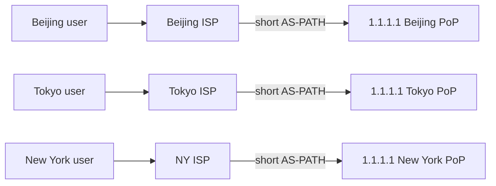

<KeyIdea>
**In one line**: **BGP** is the routing protocol of the internet backbone — Autonomous Systems (AS) use it to swap reachability info. **Anycast** is the trick of "**announcing the same IP from many places**" — packets naturally flow to the nearest PoP.
</KeyIdea>

## What it is

- **AS (Autonomous System)**: a network with its own routing policy — every ISP, cloud provider, and big enterprise has an ASN.
- **BGP**: AS-to-AS protocol that says "I can reach these prefixes".
- **Anycast**: you advertise `1.1.1.1/32` from N PoPs in N AS — incoming packets **follow BGP's best path** and land at the nearest PoP.

```
1.1.1.1 announced in Beijing, Tokyo, Singapore, London…
Routers see destination 1.1.1.1 → pick shortest AS-PATH → naturally nearest
```

## Analogy

<Analogy>
You open **identically-branded coffee shops** in every city (Anycast). Customers just ask "where's the coffee shop?" (routing) and navigation **automatically points them to the nearest one**.
</Analogy>

## Key concepts

<Terms items={[
  { term: "ASN", en: "AS Number", def: "Globally unique AS identifier, allocated by RIRs." },
  { term: "BGP peering", en: "BGP Peering", def: "Two AS swap routes — transit (paid upstream) or peering (mutual)." },
  { term: "AS Path", en: "AS Path", def: "BGP advertisement carries a list of AS — reflects the physical path." },
  { term: "Looking Glass", en: "Looking Glass", def: "Public web tools to view routes / ping / traceroute from a given AS (e.g. he.net)." },
  { term: "Anycast", en: "Anycast", def: "Same IP announced from many points; contrast with Unicast (1:1) and Multicast (1:N)." },
]} />

## How it works



Each edge PoP runs the same service; **BGP does the geographic routing**, no GeoDNS needed.

## Practical notes

- **Who can play with Anycast?** Operators with their own ASN, global PoPs, and BGP peerings with many ISPs (Cloudflare / Google / etc.).
- **Small users use GeoDNS instead**: return different IPs based on resolver location — simpler than Anycast, less precise.
- **Inspect BGP**: tools like [bgp.he.net](https://bgp.he.net) — enter an IP or ASN and view peering / paths.
- **Anycast UDP (DNS) is a natural fit** — each query is independent, mid-stream rerouting is harmless. **Anycast TCP** requires the same TCP connection to keep landing on the same PoP (route stability + hashing).
- **BGP hijacking**: a malicious AS announces someone else's prefix, diverting real traffic. **RPKI** is the partial mitigation.

## Easy confusions

<Compare
  leftTitle="Anycast"
  rightTitle="GeoDNS"
  left={<>
    Geo-awareness at the **routing layer**.<br />
    One global IP that's automatically nearest.
  </>}
  right={<>
    Different IPs returned at the **DNS layer**.<br />
    Simple and controllable, but inaccurate when resolver IP misrepresents the user.
  </>}
/>

## Further reading

- [CDN](/network/advanced/cdn)
- [Load balancing](/network/advanced/load-balancing)
- [DNS](/network/beginner/dns)
