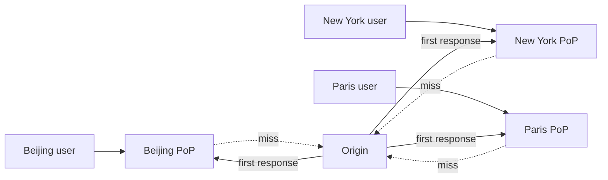

<KeyIdea>
**In one line**: a CDN caches static assets at **hundreds of edge points of presence** worldwide; users hit the nearest one. The origin only sees **cache-miss "fill" traffic**, capacity grows by orders of magnitude, and intercontinental access drops from seconds to milliseconds.
</KeyIdea>

## What it is

```
User → nearest edge PoP
        cache hit  → return immediately
        cache miss → pull from origin → cache → return
```

DNS routes the user to "**the nearest edge IP**" via **Anycast** + **GeoDNS**.

## Analogy

<Analogy>
The origin is **a central warehouse**; CDN edges are **convenience stores everywhere**. Hot products (cache hits) you buy at the corner store; cold ones (misses) the store fetches from the warehouse for you and **stocks the shelf for next time**.
</Analogy>

## Key concepts

<Terms items={[
  { term: "Origin", en: "Origin", def: "Your real server. CDN visits it on cache miss." },
  { term: "Edge / PoP", en: "Edge / Point of Presence", def: "Globally distributed cache servers." },
  { term: "TTL", en: "Cache TTL", def: "Driven by response headers Cache-Control / Expires." },
  { term: "Cache Key", en: "Cache Key", def: "Decides which requests share the same cache entry — usually URL; can include query / cookie." },
  { term: "Purge", en: "Purge", def: "Force the CDN to drop a stale entry and re-fetch from origin." },
  { term: "Anycast", en: "Anycast", def: "Multiple PoPs announce the same IP; BGP steers users to the closest one." },
]} />

## How it works



The origin only sees N misses while the system absorbs hundreds-to-thousands × the request volume.

## Practical notes

- **Set Cache-Control correctly**:

  ```
  Cache-Control: public, max-age=31536000, immutable    # static assets
  Cache-Control: no-store                               # user-private data
  Cache-Control: public, max-age=60, s-maxage=600       # pages: browser 1m, CDN 10m
  ```

- **Use versioned filenames** (`/app.abc123.js`): a new release just bumps the hash and the CDN naturally rotates.
- **Don't overuse `Vary`**: `Vary: Cookie` shards the cache per-cookie — **hit rate collapses**.
- **Run HTTPS end-to-end**: set origin to HTTPS too; avoid "Flexible SSL"-style cleartext-to-origin modes.
- **Edge compute**: Cloudflare Workers / AWS Lambda@Edge can mutate requests/responses **without going back to origin**.

## Easy confusions

<Compare
  leftTitle="CDN"
  rightTitle="Reverse proxy (nginx)"
  left={<>
    **Many** nodes worldwide.<br />
    Mostly caching + acceleration + DDoS absorption.
  </>}
  right={<>
    Usually **one** front-proxy.<br />
    Routing / auth / canary / TLS termination.
  </>}
/>

## Further reading

- [Load balancing](/network/advanced/load-balancing)
- [Anycast & BGP](/network/advanced/anycast-bgp)
- [Cloudflare](/network/ecosystem/cloudflare)
