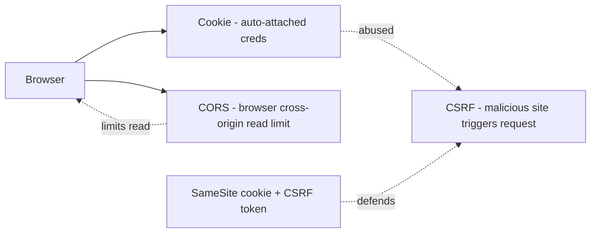

<KeyIdea>
**In one line**: a **cookie** is data the browser auto-attaches to requests; **CORS** is the browser's policy on cross-origin requests; **CSRF** is an attack exploiting that auto-attach behavior. Get the three sorted — **90 % of web-security bugs go away**.
</KeyIdea>

## Cookie

```http
Set-Cookie: session=abc; Domain=.example.com; Path=/; HttpOnly; Secure; SameSite=Lax; Max-Age=3600
```

<Terms items={[
  { term: "Domain / Path", en: "Scope", def: "Decides which requests carry the cookie." },
  { term: "HttpOnly", en: "JS-unreadable", def: "JS can't read it → defeats XSS session theft." },
  { term: "Secure", en: "HTTPS-only", def: "Only sent on https requests." },
  { term: "SameSite", en: "Same-site policy", def: "Strict / Lax (default) / None — controls whether cross-site requests carry it. **SameSite=Lax is the modern first-line CSRF defense**." },
  { term: "__Host-", en: "Prefix", def: "Forces Secure + Path=/ + no Domain — the strictest cookie class." },
]} />

## CORS (Cross-Origin Resource Sharing)

CORS is a **browser-side policy** — by default JS can't read cross-origin responses. The server must **explicitly allow it via response headers**.

```http
# Simple request
GET /api  Origin: https://app.com
→ Access-Control-Allow-Origin: https://app.com

# Complex requests first issue an OPTIONS preflight
OPTIONS /api Origin: https://app.com
       Access-Control-Request-Method: PUT
       Access-Control-Request-Headers: X-Auth
→ Access-Control-Allow-Origin: https://app.com
  Access-Control-Allow-Methods: GET, POST, PUT
  Access-Control-Allow-Headers: X-Auth
  Access-Control-Allow-Credentials: true
  Access-Control-Max-Age: 600
```

**Key insight**: CORS **doesn't protect the server** — the browser **protects the user**. Your backend curling itself never needs CORS headers.

## CSRF (Cross-Site Request Forgery)

Classic scenario:

```
You're logged into bank.com with a live cookie
→ You open evil.com which contains 
→ Browser auto-attaches the bank.com cookie
→ Bank executes the transfer (if undefended)
```

**Defenses** (modern priority order):

1. **`SameSite=Lax/Strict` cookies** — cross-site requests don't carry the cookie. Cuts the attack at the root.
2. **CSRF tokens** — server embeds a one-shot token; the cross-site attacker can't read it.
3. **Double-submit cookie** — match a header against a cookie; stateless on the server.
4. **Check Origin / Referer** as a fallback.
5. **Never accept state-changing GETs** — GET should never modify state.

## How they relate



## Practical notes

- **Use HttpOnly + Secure + SameSite=Lax cookies for sessions**. **Don't put tokens in localStorage** — XSS = account compromise.
- **Common CORS gotcha**: `Allow-Origin: *` + `Allow-Credentials: true` — browsers reject this. With credentials you must specify the origin.
- **OPTIONS preflight failure = CORS error** — DevTools shows exactly which header is missing or the origin mismatch.
- **Cookie sharing across subdomains**: when `api.example.com` and `www.example.com` share `.example.com`, set `Domain=.example.com` explicitly.
- **Cross-domain SSO** must use OAuth / SAML, not cookies.
- **API for native apps / server-to-server**: doesn't go through a browser → CORS / CSRF don't apply, but you **still need authentication** (API key / OAuth / mTLS).

## Easy confusions

<Compare
  leftTitle="CORS"
  rightTitle="CSRF"
  left={<>
    Browser **proactively limits** cross-origin response reads.<br />
    Concerns "can I read the data".
  </>}
  right={<>
    Attacker **abuses** auto-cookie behavior.<br />
    Concerns "will I be impersonated into submitting".
  </>}
/>

## Further reading

- [HTTP](/network/beginner/http)
- [HTTPS & certificates](/network/beginner/https)
- [TLS handshake](/network/advanced/tls-handshake)
