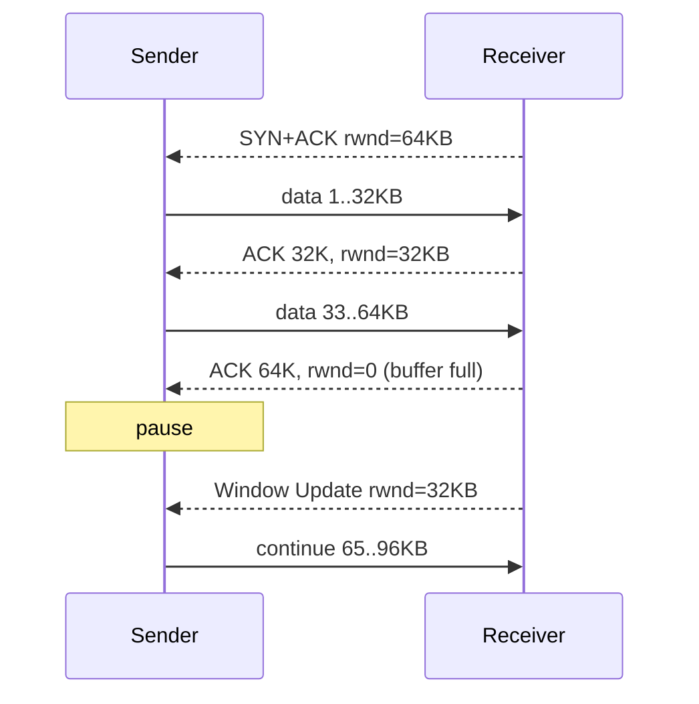

<KeyIdea>
**In one line**: in every ACK, the receiver tells the sender "**I can accept N more bytes**" (receive window, rwnd). The sender **never exceeds rwnd** — making receiver-buffer overflow structurally impossible.
</KeyIdea>

## What it is

```
send window = min(rwnd, cwnd)
              ↑              ↑
       receiver capacity   sender's network estimate
```

The sender maintains a sliding window with four regions: **acked / sent-but-unacked / sendable / not-yet-allowed**. Each ACK slides it right.

## Analogy

<Analogy>
You're delivering buckets of water. Your friend says "**I have room for 5 more**" (rwnd=5), so you send 5. After they drink 3, they say "**room for 3 more**" (rwnd=3), and you continue. **You never deliver more than the kitchen can hold.**
</Analogy>

## Key concepts

<Terms items={[
  { term: "rwnd", en: "Receive Window", def: "Receiver-advertised free space in its receive buffer." },
  { term: "Window Scaling", en: "Window Scaling", def: "Plain rwnd is 16 bits (max 64KB); TCP option scales it up to 1GB." },
  { term: "Zero Window", en: "Zero Window", def: "rwnd=0; sender pauses and probes via Window Probe." },
  { term: "Nagle's algorithm", en: "Nagle", def: "Coalesces small writes — saves overhead at the cost of **extra latency**." },
  { term: "Delayed ACK", en: "Delayed ACK", def: "Receiver waits a bit before ACKing. Paired with Nagle, this causes the classic **deadlock-like stall**." },
]} />

## How it works



The slower the receiver app reads, the smaller rwnd shrinks, and the sender slows down accordingly.

## Practical notes

- **Modern OSes enable Window Scaling by default** — required for transoceanic "long fat pipes" (high BDP).
- **Tune server receive buffers**:

  ```bash
  sysctl -w net.core.rmem_max=16777216
  sysctl -w net.ipv4.tcp_rmem='4096 87380 16777216'
  ```

  Too-small buffers cap rwnd and starve the wire.
- **Slow `read()` in the app** keeps rwnd at 0 for long periods, stalling the sender — looks like "packet loss" but is really "**slow reader**".
- **Disable Nagle (`TCP_NODELAY`)** for latency-sensitive small writes (IM, games, interactive SSH).
- **Don't conflate rwnd with cwnd**: rwnd is **receiver capacity**, cwnd is **network capacity** — the sender takes the smaller of the two.

## Easy confusions

<Compare
  leftTitle="rwnd is full"
  rightTitle="cwnd halved"
  left={<>
    **Receiver app reads too slowly**.<br />
    Fix: bigger buffer / faster reader.
  </>}
  right={<>
    **Network packet loss**.<br />
    Fix: better link / different congestion algo (e.g. BBR).
  </>}
/>

## Further reading

- [TCP three-way handshake](/network/advanced/tcp-handshake)
- [TCP congestion control](/network/advanced/congestion-control)
