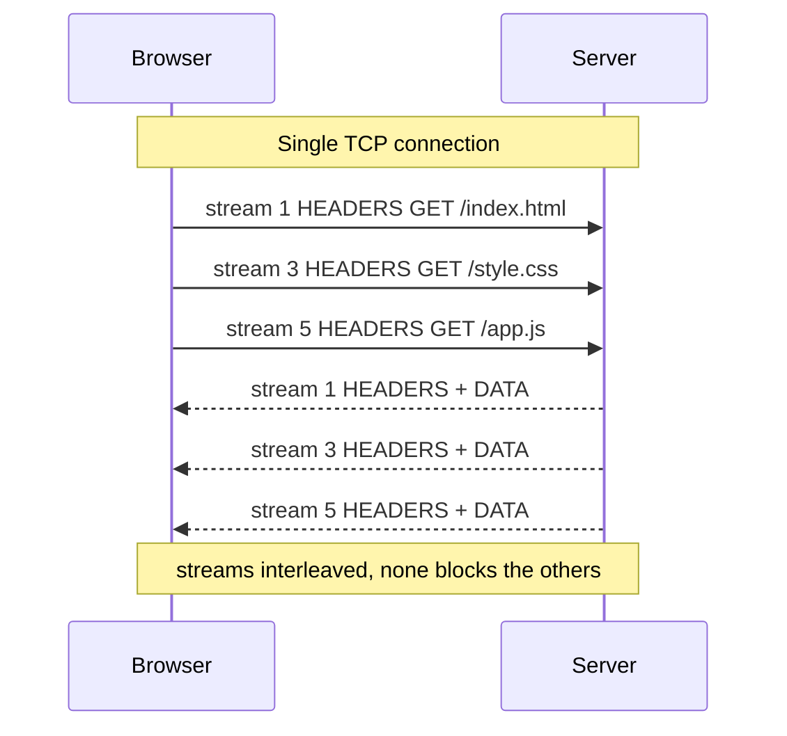

<KeyIdea>
**In one line**: HTTP/2 replaces 1.1's text protocol with **binary frames** and **multiplexes many requests on one TCP connection**, slashing connection-setup cost and head-of-line blocking at the application layer.
</KeyIdea>

## What it is

HTTP/1.1 pain points:
- One in-flight request per connection — **serial**.
- Browsers worked around this by opening 6 TCP connections per origin (still not enough).

HTTP/2's redesign:

| Feature | Meaning |
| --- | --- |
| **Binary framing** | Requests / responses become frames; many streams interleave on the same connection. |
| **Multiplexing** | Tens of streams concurrently share one connection without blocking. |
| **HPACK header compression** | Static + dynamic tables compress repeated headers down to a few bytes. |
| **Server push** | Server can pre-push assets (now largely deprecated in browsers). |
| **Priorities** | Streams have weights; browsers tell the server which to send first. |

## Analogy

<Analogy>
HTTP/1.1 = **single-lane road** — only one car at a time.
HTTP/2 = **multi-lane highway** — dozens of cars on the same road (TCP) running side-by-side.
</Analogy>

## Key concepts

<Terms items={[
  { term: "Stream", en: "Stream", def: "A request/response pair; each has a unique ID." },
  { term: "Frame", en: "Frame", def: "Smallest unit inside a stream: HEADERS / DATA / SETTINGS / PING / GOAWAY etc." },
  { term: "HPACK", en: "Header Compression", def: "Static table (~80 common headers) + a shared dynamic table compress repeated headers to a few bytes." },
  { term: "Stream Priority", en: "Stream Priority", def: "Tree-structured weights — browser tells server what to send first." },
  { term: "Head-of-line blocking", en: "HoL Blocking", def: "HTTP/2 fixes application-layer HoL; TCP-layer HoL remains — only HTTP/3 fully fixes it." },
]} />

## How it works

Open a page and dozens of assets arrive **in parallel**.

## Practical notes

- **Requires HTTPS.** Modern browsers only do HTTP/2 over TLS (h2 over TLS). Cleartext h2c is server-to-server only.
- **Verify it's H2**: `curl -I --http2 https://...` or DevTools' Network panel "Protocol" column.
- **Enable on the server**: nginx `listen 443 ssl http2;`; Caddy is on by default.
- **Stop doing 1.1 micro-optimizations** — domain sharding, sprite sheets, inlined assets are **counter-productive** under H2.
- **TCP HoL still bites.** Any packet loss stalls every stream on that TCP connection — only **HTTP/3** truly solves this.

## Easy confusions

<Compare
  leftTitle="HTTP/2"
  rightTitle="HTTP/3"
  left={<>
    Runs over **TCP + TLS**. 
    Application-layer multiplexing, **TCP-layer HoL remains**.
  </>}
  right={<>
    Runs over **QUIC (UDP)**. 
    Streams are truly independent — **no HoL**.
  </>}
/>

## Further reading

- [HTTP basics](/network/beginner/http)
- [HTTP/3 & QUIC](/network/advanced/http3-quic)
- [TLS handshake](/network/advanced/tls-handshake)
