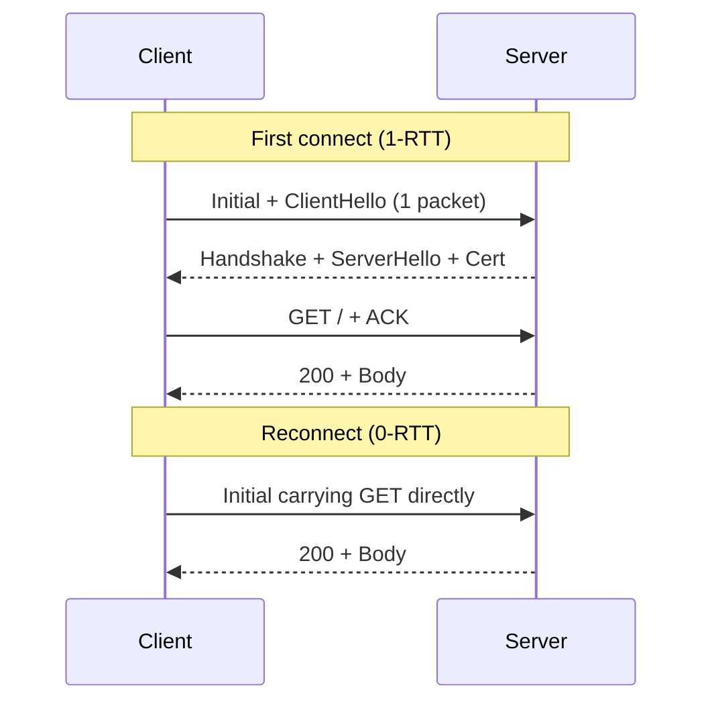

<KeyIdea>
**In one line**: **QUIC** is a transport-layer protocol (originally from Google, now an IETF standard) that runs on UDP and bundles **TLS 1.3 + multiplexing + flow control + congestion control**. HTTP/3 = HTTP over QUIC — **1-RTT setup, connection migration, no TCP HoL**.
</KeyIdea>

## What it is

```
HTTP/1.1: HTTP   over TCP
HTTP/2:   HTTP   over TLS over TCP
HTTP/3:   HTTP   over QUIC over UDP
```

QUIC redoes the transport layer. Because TCP is a kernel protocol that's hard to evolve, QUIC is implemented in **user space** on top of UDP — letting browsers and servers iterate freely.

## Analogy

<Analogy>
TCP is **the old train** — reliable, predictable, hard to upgrade.
QUIC is **a private high-speed rail** — add features at will: new algorithms, connection migration, 0-RTT — ship today, deploy tomorrow.
</Analogy>

## Key concepts

<Terms items={[
  { term: "0-RTT resume", en: "0-RTT Resumption", def: "When reconnecting to the same server, the very first packet can carry HTTP data — saves an RTT." },
  { term: "Connection migration", en: "Connection Migration", def: "QUIC uses a Connection ID, so swapping 4G ↔ Wi-Fi (different IP) **doesn't drop the connection**." },
  { term: "No TCP HoL", en: "No HoL Blocking", def: "QUIC's streams are independent at the transport layer; losing one packet only blocks one stream." },
  { term: "Built-in TLS 1.3", en: "Always Encrypted", def: "QUIC has no plaintext mode — even handshake metadata is encrypted." },
  { term: "Userspace impl", en: "Userspace", def: "Servers handle QUIC in the application layer — fast iteration." },
]} />

## How it works



QUIC merges the TLS handshake and the protocol handshake — the client ships data immediately.

## Practical notes

- **Verify a page uses H3**: in Chrome DevTools the Protocol column shows `h3-29` / `h3`.
- **Enable on servers**:
  - nginx 1.25+ with the `quic` module;
  - Caddy 2 enables H3 by default;
  - Cloudflare / Fastly toggle it for you.
- **HTTPS-only**: like H2, requires TLS (1.3 only).
- **Some networks block UDP.** QUIC uses UDP 443; corporate / campus firewalls may drop it. Browsers auto-fallback to HTTP/2.
- **`Alt-Svc` header**: server tells the browser "I also speak H3 — switch over next time".

## Easy confusions

<Compare
  leftTitle="HTTP/3 over QUIC"
  rightTitle="HTTP/2 over TCP"
  left={<>
    Runs on **UDP 443**.<br />
    1-RTT / 0-RTT setup.<br />
    Streams truly independent — packet loss confined.
  </>}
  right={<>
    Runs on **TCP 443**.<br />
    ≥ 2-RTT setup (TCP + TLS).<br />
    Packet loss stalls all streams.
  </>}
/>

## Further reading

- [HTTP/2](/network/advanced/http2)
- [TLS handshake](/network/advanced/tls-handshake)
- [TCP congestion control](/network/advanced/congestion-control) — QUIC ships its own BBR-style algorithms
