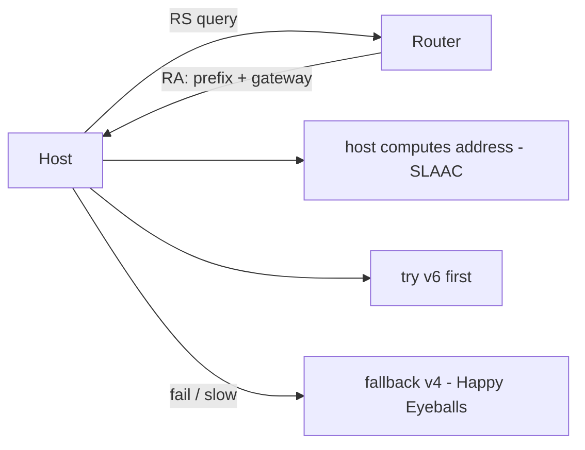

<KeyIdea>
**In one line**: IPv6 grows the address pool from 32 bits (4.3 B) to **128 bits (3.4×10³⁸)** — and along the way removes NAT, broadcast, and on-path fragmentation, plus a much friendlier auto-configuration story.
</KeyIdea>

## What it is

Format: 8 groups of 16-bit hex, separated by `:`; consecutive zeros compress to `::`:

```
2001:0db8:85a3:0000:0000:8a2e:0370:7334
   ↓ shortened
2001:db8:85a3::8a2e:370:7334
```

A modern host usually carries both **IPv4 and IPv6 (dual-stack)**.

## Analogy

<Analogy>
IPv4 is like **an 8-digit city phone number** — eventually exhausted, so people stitched together **switchboard + extension** (NAT).
IPv6 is like **a globally unique 38-digit number per device** — every device, even per-process, can be globally addressable. No switchboard needed.
</Analogy>

## Key concepts

<Terms items={[
  { term: "Prefix length", en: "Prefix Length", def: "Same idea as IPv4 CIDR: /64 = one subnet; /56 or /48 are common allocations to customers." },
  { term: "Link-local", en: "fe80::/10", def: "Per-link auto address — every IPv6 interface gets one." },
  { term: "ULA", en: "fc00::/7", def: "Like IPv4 private addresses — internal-only." },
  { term: "SLAAC", en: "Stateless Address Autoconfiguration", def: "Host hears a router advertisement and computes its global address itself — no central DHCP needed." },
  { term: "Dual Stack", en: "Dual Stack", def: "v4 and v6 active simultaneously; apps pick the faster path via Happy Eyeballs." },
  { term: "NAT64 / 464XLAT", en: "Transition Tech", def: "Lets v6-only networks talk to v4 internet — common at carriers." },
]} />

## How it works



SLAAC + RA give hosts **DHCP-like auto-config** without a centralized DHCP server.

## Practical notes

- **`ip -6 addr`** lists IPv6 addresses (Linux).
- **Check connectivity**: `ping6 ipv6.google.com` or [test-ipv6.com](https://test-ipv6.com).
- **Bind both stacks**: nginx `listen [::]:443 ssl;`. Log formats need `[%h]` to bracket v6 addresses.
- **Publish AAAA records.** Dual-stack services must have AAAA so Happy Eyeballs can pick the fastest path.
- **Firewall**: don't forget ip6tables (or use nftables to manage both) — many sites are accidentally exposed because they only wrote v4 rules.
- **Common myth**: "internal corp doesn't need IPv6". Mobile / home broadband is mostly v6 by default — **public-facing v6 support is a user-experience issue**.

## Easy confusions

<Compare
  leftTitle="IPv4 + NAT"
  rightTitle="IPv6"
  left={<>
    Address shortage → many devices share one public IP.<br />
    Causes hole-punching / P2P headaches.
  </>}
  right={<>
    Every device gets a real public address.<br />
    Default firewall blocks inbound — **still harden it**.
  </>}
/>

## Further reading

- [IP address](/network/beginner/ip-address)
- [NAT](/network/beginner/nat)
- [Subnet & CIDR](/network/beginner/subnet-cidr)
