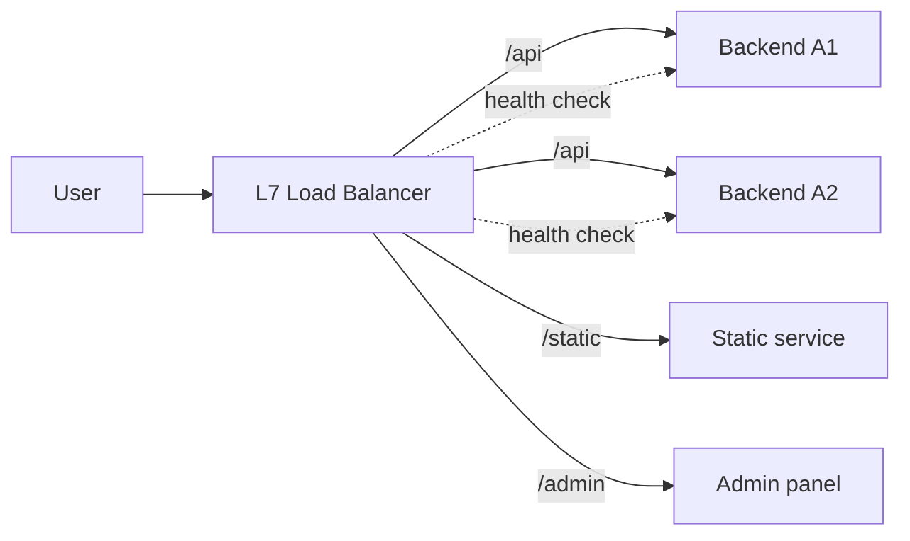

<KeyIdea>
**In one line**: a load balancer **fans out** external traffic to multiple backends. **L4** operates at the TCP layer (HTTP-blind); **L7** operates at the HTTP layer (routes by path / header / cookie). Production usually layers **both**.
</KeyIdea>

## What it is

```
[client] → [L4 LB (IPVS/LVS)] → [L7 LB (nginx)] → [backend instances]
```

- **L4**: looks at IP/port, forwards TCP connections. Extremely fast — millions of QPS.
- **L7**: parses HTTP, routes by path / header / cookie. More features, more overhead.

## Analogy

<Analogy>
**L4** is like **airport routing**: the **flight number** (port) decides which terminal you go to — never mind whether you're flying for business or leisure.
**L7** is like **a hotel concierge**: based on **room preferences / loyalty tier** (HTTP headers) you go to a different room.
</Analogy>

## Key concepts

<Terms items={[
  { term: "Round Robin", en: "Round Robin", def: "Cycle through backends in order. Simple." },
  { term: "Least Connections", en: "Least Connections", def: "Send the next request to the backend with the fewest active connections — great for long-lived workloads." },
  { term: "Consistent Hashing", en: "Consistent Hashing", def: "Hash by some key (e.g. user-id) to a stable backend — affinity that survives scale events with minimal remapping." },
  { term: "Weighted", en: "Weighted", def: "Heterogeneous instances get different weights." },
  { term: "Health check", en: "Health Check", def: "Active probes that take a sick instance out of rotation automatically." },
  { term: "Sticky session", en: "Sticky Session", def: "Pin a user to one backend every time — **scales poorly**; prefer stateless + shared session store." },
]} />

## How it works



Failing instances are removed automatically and re-added once they recover.

## Practical notes

- **Common implementations**:
  - L4: LVS / IPVS (kernel-space, ridiculously fast); HAProxy can also do L4.
  - L7: nginx / HAProxy / Traefik / Envoy / Caddy.
- **Cloud-managed**: ALB (L7) / NLB (L4) on AWS, equivalents on GCP / Aliyun.
- **Health-check tuning**: every 2–5 s, fail after 2 consecutive misses, return after 2 successes — typical baseline.
- **Set timeouts deliberately**: `connect_timeout` (dial) / `read_timeout` (response) / `send_timeout` — missing any one of them can pile up dangling connections.
- **Graceful drain**: on deploy, remove the instance from the LB, let in-flight requests finish, **then** kill the process.
- **DNS is "poor man's LB"**: returning multiple A records lets the client pick — but it's slow, cache-stale, and lacks health checks; reserve it for cross-region routing in front of real LBs.

## Easy confusions

<Compare
  leftTitle="L4 (TCP)"
  rightTitle="L7 (HTTP)"
  left={<>
    Forwards TCP connections.<br />
    Insanely fast, URL-blind.<br />
    Good for DB / custom protocols.
  </>}
  right={<>
    Parses HTTP.<br />
    Routes by path / cookie.<br />
    Good for web / API gateways.
  </>}
/>

## Further reading

- [CDN](/network/advanced/cdn)
- [Anycast & BGP](/network/advanced/anycast-bgp)
- [nginx](/network/ecosystem/nginx)
- [HAProxy](/network/ecosystem/haproxy)
