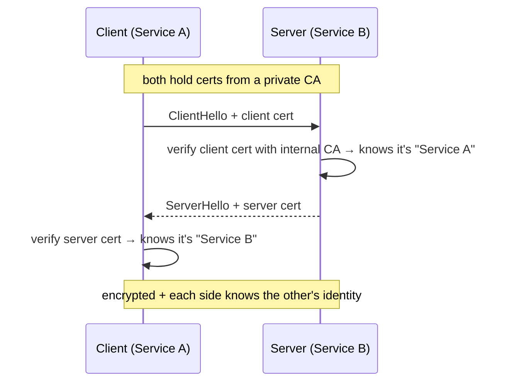

<KeyIdea>
**In one line**: mTLS = mutual TLS — **both sides verify each other's certificate**. Replaces "IP allowlist + shared token" inside private networks with **cryptographic service identity**.
</KeyIdea>

## What it is

Plain HTTPS: client validates the server's cert.
mTLS: the client **also presents a cert** during handshake; the server validates it against an internal CA.

```
Plain TLS: client → verifies → server cert
mTLS:      client ⇄ mutually verify ⇄ server + client cert
```

## Analogy

<Analogy>
Plain HTTPS is like **walking into a mall** — seeing the mall's signage is enough.
mTLS is like **entering a corporate building** — security checks **your employee badge** before letting you in, and you verify this is **the real front entrance** (not a phishing setup).
</Analogy>

## Key concepts

<Terms items={[
  { term: "Client cert", en: "Client Certificate", def: "Signed by an internal CA; identifies a service / machine / user." },
  { term: "Private CA", en: "Internal CA", def: "Org-owned root cert; distributed to all services to sign short-lived leaf certs." },
  { term: "SPIFFE / SPIRE", en: "Identity framework", def: "Cloud-native standard for automatic issuance, rotation, and binding to K8s ServiceAccounts." },
  { term: "Cert rotation", en: "Cert Rotation", def: "Short-lived certs (hours / days) auto-renewed; stolen certs die on their own." },
  { term: "Zero trust", en: "Zero Trust", def: "Trust no network position — every access is gated by identity + policy." },
]} />

## How it works



A service mesh (Istio / Linkerd) makes this **fully automatic** via sidecars.

## Practical notes

- **Manual nginx mTLS**:

  ```nginx
  ssl_client_certificate /etc/nginx/ca.crt;
  ssl_verify_client on;
  ```

- **Auto mTLS in a service mesh**: Istio / Linkerd enable mTLS between sidecars by default.
- **mTLS at the API gateway**: common in finance / banking — mobile apps present client certs to prove "I'm the real app".
- **Cert lifecycle**: cert-manager (K8s) / Vault PKI mint short-lived leaf certs automatically.
- **Revocation**: CRL / OCSP are awkward in practice — **short lifetimes + no renewal** is the realistic revocation path.

## Easy confusions

<Compare
  leftTitle="API Token / JWT"
  rightTitle="mTLS"
  left={<>
    Bearer at the application layer.<br />
    One leak = repeated reuse.
  </>}
  right={<>
    Cert at the transport layer.<br />
    Every handshake verifies — **cryptographically bound** to a specific service instance.
  </>}
/>

## Further reading

- [TLS handshake](/network/advanced/tls-handshake)
- [HTTPS](/network/beginner/https) / [TLS](/network/beginner/tls)
