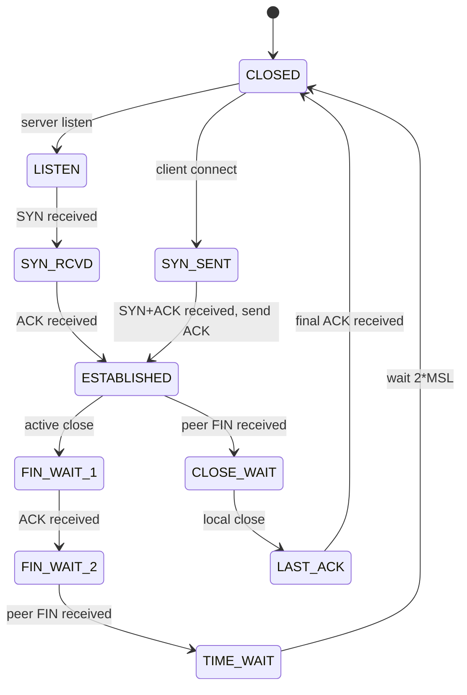

<KeyIdea>
**In one line**: the **three-way handshake** lets each side confirm "**I can send / you can receive / you can send / I can receive**"; the **four-way termination** exists because TCP is **full duplex** — each direction is closed independently.
</KeyIdea>

## What it is

```
Handshake:
  C → S  SYN seq=x
  C ← S  SYN+ACK seq=y, ack=x+1
  C → S  ACK ack=y+1
  Connection established.

Termination:
  C → S  FIN
  C ← S  ACK         (got it; let me finish flushing)
  C ← S  FIN         (I'm done too)
  C → S  ACK
  Connection closed.
```

## Analogy

<Analogy>
**Handshake** = a phone call: "Hello?" "Hi!" "OK, let's talk." Each side checks "**I can hear + you can hear**" once.
**Termination** = both sides agreeing to hang up: "I'm done speaking." "OK, let me finish too." (more bytes possible in between) "I'm done too." "OK, hanging up."
</Analogy>

## Key concepts

<Terms items={[
  { term: "SYN", en: "Synchronize", def: "Step one — request to open, carries an initial sequence number." },
  { term: "ACK", en: "Acknowledge", def: "Confirms receipt of a byte range. Every TCP segment carries an ACK field." },
  { term: "FIN", en: "Finish", def: "I'm done sending in this direction." },
  { term: "TIME_WAIT", en: "Time Wait", def: "Active closer waits 2*MSL (~60 s) before fully releasing — prevents stale segments from confusing a new connection on the same tuple." },
  { term: "Half-close", en: "Half-close", def: "After one side FINs, the other can keep sending." },
  { term: "RST", en: "Reset", def: "Forced abort, skips the four-way dance — common on closed ports / abnormal exits." },
]} />

## State machine



In production, the two **most common pains** are `TIME_WAIT` accumulation (high-concurrency short-lived connections) and `CLOSE_WAIT` lingering (the app never called close()).

## Practical notes

- **`netstat -an | awk '{print $6}' | sort | uniq -c`** — connection count per state.
- **Too many `TIME_WAIT`s?** Enable `tcp_tw_reuse` on Linux to recycle. **Avoid** `tcp_tw_recycle` (removed since 4.12 — broke connectivity behind NAT).
- **`CLOSE_WAIT` is a bug.** Your app received the peer's FIN but never called close(). Use `lsof` to find the leak.
- **SYN flood**: forged SYNs fill the half-open queue. Enable `syncookies` as a defense.
- **TFO (TCP Fast Open)**: payload travels with the handshake, saving 1 RTT — but middleboxes / peers spotty support, not widely deployed.

## Easy confusions

<Compare
  leftTitle="Graceful FIN close"
  rightTitle="RST abort"
  left={<>
    Four-way teardown, **pending data delivered**.<br />
    Application called close().
  </>}
  right={<>
    Single RST packet, **unsent data may be lost**.<br />
    Port not listening / app crashed / SO_LINGER 0.
  </>}
/>

## Further reading

- [TCP congestion control](/network/advanced/congestion-control)
- [TCP flow control](/network/advanced/flow-control)
- [TCP vs UDP](/network/beginner/tcp-vs-udp)
