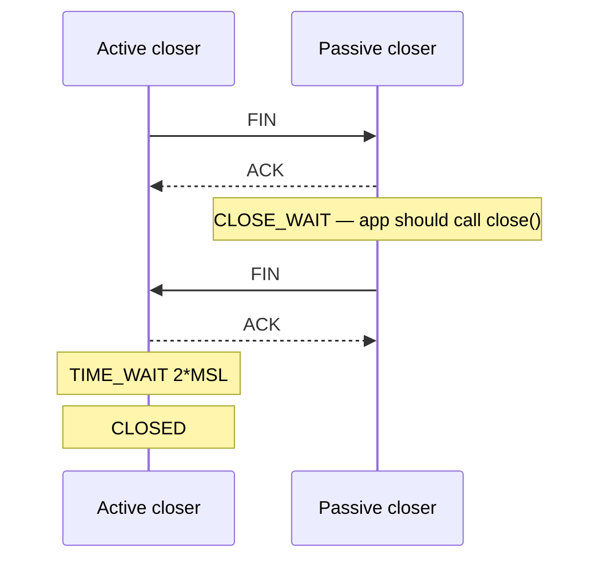

<KeyIdea>
**In one line**: `TIME_WAIT` is a **mandatory wait period** in the TCP spec for the active closer; `CLOSE_WAIT` is a **bug in your application** — you received the peer's FIN but never called `close()`.
</KeyIdea>

## What it is

Active closer:

```
ESTABLISHED → FIN_WAIT_1 → FIN_WAIT_2 → TIME_WAIT (2*MSL ≈ 60s) → CLOSED
```

Passive closer:

```
ESTABLISHED → CLOSE_WAIT → LAST_ACK → CLOSED
                  ↑
       app forgot close() — gets stuck here
```

## Analogy

<Analogy>
**TIME_WAIT** = after hanging up, you keep the receiver to your ear for a moment to make sure no late echo arrives.
**CLOSE_WAIT** = the other side said "I'm hanging up", you **murmured "OK" but never actually put the receiver down**, and the line stays busy.
</Analogy>

## Key concepts

<Terms items={[
  { term: "MSL", en: "Max Segment Lifetime", def: "Maximum lifetime of a segment in the network (~30 s). 2*MSL ensures any in-flight packets fully die before the tuple is reused." },
  { term: "TIME_WAIT risk", en: "source-port exhaustion", def: "A client doing many short-lived connections quickly burns through ~28K local ports stuck in TIME_WAIT." },
  { term: "CLOSE_WAIT risk", en: "fd leak", def: "Application file descriptors leak slowly, ending in 'too many open files'." },
  { term: "tcp_tw_reuse", en: "TW reuse", def: "Linux knob — lets new outbound connections reuse a TIME_WAIT-occupied local port." },
  { term: "SO_LINGER 0", en: "forced RST close", def: "Skips the four-way teardown and emits an RST — **dangerous**, in-flight data is lost." },
]} />

## How it works



**Whichever side calls `close()` first becomes the active closer.**

## Practical notes

- **Count states**:

  ```bash
  ss -tan | awk '{print $1}' | sort | uniq -c
  ```

- **Too many TIME_WAITs (10k+)**:
  - On the client: `net.ipv4.tcp_tw_reuse=1`, widen `ip_local_port_range`.
  - On the server: usually harmless (passive closer doesn't enter TIME_WAIT — prefer **keep-alive / persistent connections** anyway).
  - **Do not** enable `tcp_tw_recycle` (removed from Linux).
- **CLOSE_WAIT keeps climbing**:
  - Find leaked fds: `lsof -p <pid> | grep CLOSE_WAIT`.
  - Audit your code's error paths for missing `defer conn.Close()`.
  - Reverse-proxy backends: check whether your idle-timeout actually closes the socket.
- **HTTP keep-alive / connection pools**: reusing connections instead of opening one per request is the most permanent fix.

## Easy confusions

<Compare
  leftTitle="TIME_WAIT"
  rightTitle="CLOSE_WAIT"
  left={<>
    **Protocol requirement**.<br />
    Disappears on its own.<br />
    Usually solvable by tuning sysctls.
  </>}
  right={<>
    **Application bug**.<br />
    Stays forever until fixed.<br />
    Must change code.
  </>}
/>

## Further reading

- [TCP three-way handshake](/network/advanced/tcp-handshake)
- [TCP flow control](/network/advanced/flow-control)
