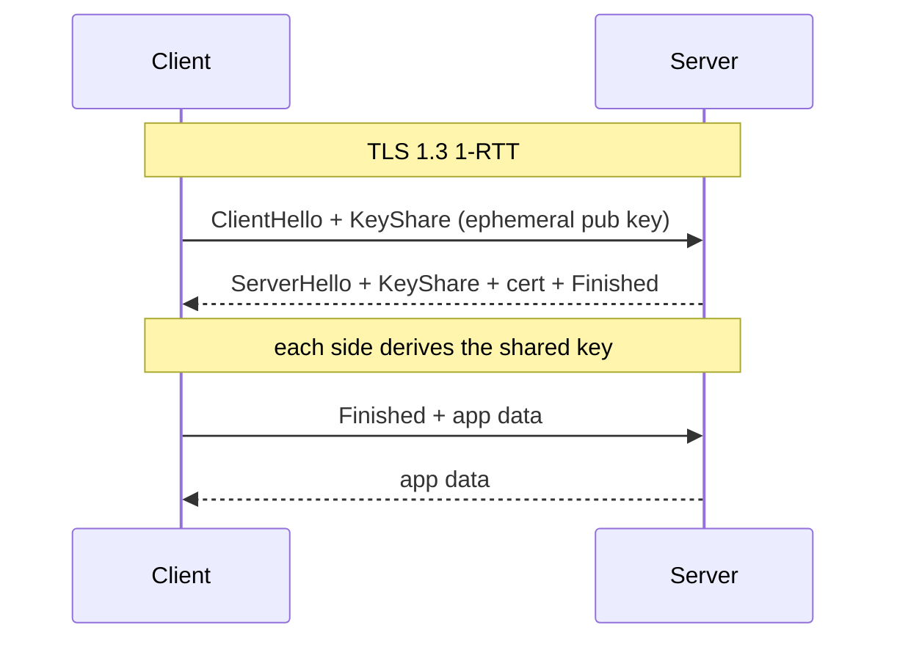

<KeyIdea>
**In one line**: the TLS handshake **negotiates ciphers, validates the server, and derives the session key**. 1.3 trims one RTT off 1.2 (app data ships within the handshake) and **mandates forward secrecy**.
</KeyIdea>

## What it is

TLS 1.2 full handshake:

```
ClientHello             →
                        ←  ServerHello, cert, ServerKeyExchange, Done
ClientKeyExchange,
ChangeCipherSpec,
Finished                →
                        ←  ChangeCipherSpec, Finished
─── application data ───
```

That's **2 RTTs** before you can send a byte of payload.

TLS 1.3:

```
ClientHello + KeyShare  →
                        ←  ServerHello + KeyShare + cert + Finished
Finished, app data      →
```

**1 RTT** to first byte, plus optional 0-RTT resumption.

## Analogy

<Analogy>
**TLS 1.2** = two people who shake hands three times before they can talk.
**TLS 1.3** = the moment you extend your hand, they hand back a card, ID, and shared signal all at once; you nod and you're **already in the conversation**.
</Analogy>

## Key concepts

<Terms items={[
  { term: "Cipher Suite", en: "Cipher Suite", def: "The 'key exchange + signature + symmetric cipher + MAC' combo agreed during handshake. 1.3 trims this list dramatically (AEAD only)." },
  { term: "ECDHE", en: "Elliptic Curve Diffie-Hellman", def: "Only allowed key exchange in 1.3. Each handshake generates ephemeral keys → forward secrecy." },
  { term: "PFS", en: "Perfect Forward Secrecy", def: "Even if the long-term private key leaks later, captured traffic cannot be decrypted. Mandatory in 1.3." },
  { term: "Session Ticket", en: "Session Ticket", def: "Server-encrypted resumption credential handed to the client; enables 0-RTT next time." },
  { term: "ALPN", en: "Application-Layer Protocol Negotiation", def: "Inside the TLS handshake, picks h2 / http/1.1 / h3 etc." },
]} />

## How it works



QUIC embeds TLS 1.3 inside its own handshake — that's where **HTTP/3's 1-RTT** comes from.

## Practical notes

- **Force 1.3** in nginx: `ssl_protocols TLSv1.2 TLSv1.3;` — drop 1.0/1.1.
- **Inspect a handshake**: `openssl s_client -connect host:443 -tls1_3`.
- **OCSP Stapling**: server fetches and attaches the cert revocation status — saves the client a round-trip.
- **OCSP Must-Staple** + **CT logs**: extra hardening for high-stakes domains.
- **0-RTT cautiously**: early data isn't replay-protected — only safe for **idempotent endpoints (GET)**.
- **mTLS**: server also verifies a client cert. Common in zero-trust internal networks and service meshes.

## Easy confusions

<Compare
  leftTitle="TLS 1.2"
  rightTitle="TLS 1.3"
  left={<>
    2-RTT full handshake.<br />
    Allows static-RSA key exchange (no PFS).
  </>}
  right={<>
    1 RTT; optional 0-RTT resumption.<br />
    Mandatory ECDHE + AEAD — **forward secrecy is the floor**.
  </>}
/>

## Further reading

- [HTTPS](/network/beginner/https) / [TLS](/network/beginner/tls)
- [HTTP/3 & QUIC](/network/advanced/http3-quic)
- [mTLS](/network/advanced/mtls)
