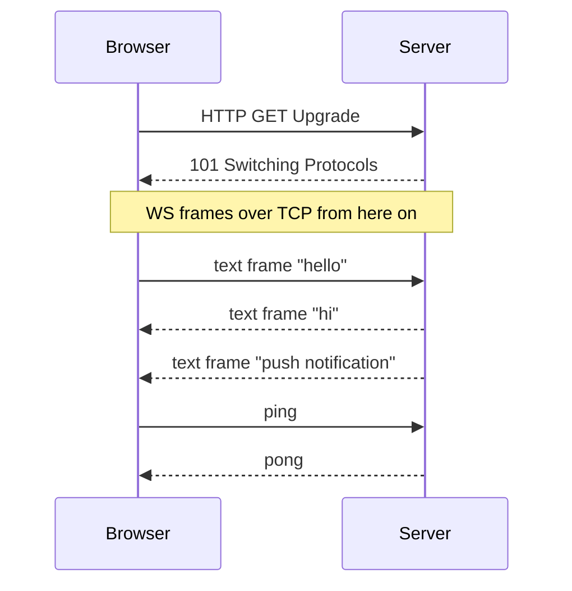

<KeyIdea>
**In one line**: WebSocket performs an HTTP **Upgrade** that promotes a TCP connection to a **full-duplex long-lived channel**, after which both sides can send messages **at any time** — no longer locked into request/response.
</KeyIdea>

## What it is

```
Browser:                     Server:
GET /chat HTTP/1.1
Upgrade: websocket
Connection: Upgrade
Sec-WebSocket-Key: dGhl...
                              HTTP/1.1 101 Switching Protocols
                              Upgrade: websocket
                              Connection: Upgrade
                              Sec-WebSocket-Accept: s3pPLM...
─── WebSocket frames over the same TCP from here on ───
```

The handshake uses HTTP/1.1 (firewall-friendly); after Upgrade, **the protocol on this TCP changes**.

## Analogy

<Analogy>
HTTP is **SMS** — you send a text and wait for a reply.
WebSocket is **a connected phone call** — either side can speak at any time without waiting for the other to start.
</Analogy>

## Key concepts

<Terms items={[
  { term: "Upgrade handshake", en: "Handshake", def: "Switches to WebSocket via HTTP Upgrade header; the server returns 101." },
  { term: "Frame", en: "Frame", def: "Unit of WebSocket data — opcode (text/binary/close/ping/pong) plus payload." },
  { term: "Mask", en: "Mask", def: "Frames from client to server must be masked (4-byte random XOR) to prevent middlebox misinterpretation." },
  { term: "Ping / Pong", en: "Heartbeat", def: "Application-layer keep-alive; avoids idle disconnects by middleboxes / load balancers." },
  { term: "Sub-protocol", en: "Sub-protocol", def: "Declared via `Sec-WebSocket-Protocol`; app-layer semantics is your choice (mqtt / graphql-ws / signalr)." },
]} />

## How it works



Good fits: **real-time chat, collaborative editing, market-data push, games, IoT control**.

## Practical notes

- **Over HTTPS, use `wss://`** — avoids proxy / browser interference.
- **Heartbeat is mandatory.** Send a ping every ~30 s; idle middleboxes will kill the connection at ~60 s.
- **Reverse proxies must enable Upgrade**:

  ```nginx
  proxy_http_version 1.1;
  proxy_set_header Upgrade $http_upgrade;
  proxy_set_header Connection "upgrade";
  proxy_read_timeout 300s;
  ```

- **Don't roll your own RPC over WS.** Use mature sub-protocols ([graphql-ws](https://github.com/enisdenjo/graphql-ws) / [socket.io](https://socket.io) / mqtt / signalr).
- **HTTP/2 doesn't replace WS.** H2 supports bidirectional streams but browser fetch APIs **don't expose** them. WebSocket remains the de-facto browser real-time standard.
- **WebTransport (HTTP/3)** is the future — QUIC-based, lighter, supports unreliable streams.

## Easy confusions

<Compare
  leftTitle="WebSocket"
  rightTitle="SSE (Server-Sent Events)"
  left={<>
    Full-duplex.<br />
    Heavier — needs server / proxy to cooperate.
  </>}
  right={<>
    One-way (server → client).<br />
    Plain HTTP — browsers use EventSource directly.
  </>}
/>

## Further reading

- [HTTP basics](/network/beginner/http)
- [HTTP/3 & QUIC](/network/advanced/http3-quic)
- [TCP three-way handshake](/network/advanced/tcp-handshake)
