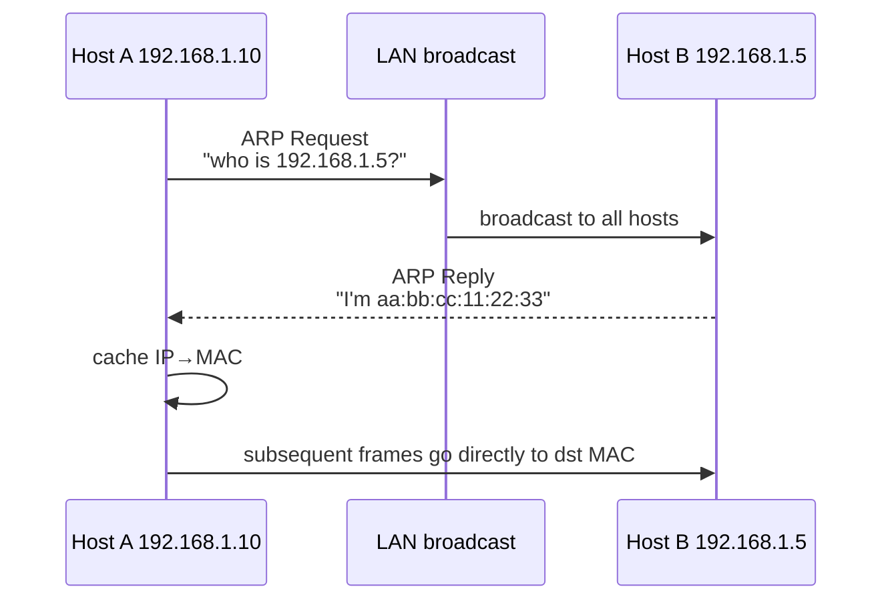

<KeyIdea>
**In one line**: **ARP** translates IPs into MACs within the same LAN. Before sending to a same-subnet IP, a host broadcasts "**who is this IP**"; the target replies with its MAC, and the result is **cached** for a few minutes.
</KeyIdea>

## What it is

ARP runs **above the link layer but outside IP** — it's not an IP packet but a parallel Ethernet frame type (EtherType `0x0806`).

```
ARP Request (broadcast):
  "Who has 192.168.1.5? Tell 192.168.1.10"
ARP Reply (unicast):
  "192.168.1.5 is at aa:bb:cc:11:22:33"
```

## Analogy

<Analogy>
You know your friend's **address** (IP), but which **door** does the courier knock on? The courier shouts "**who's at 192.168.1.5?**" in the courtyard; the answering resident gives them the **door tag** (MAC); next time the courier knocks directly.
</Analogy>

## Key concepts

<Terms items={[
  { term: "ARP Request", en: "ARP Request", def: "Broadcast frame (dst MAC ff:ff:ff:ff:ff:ff) asking 'who has this IP'." },
  { term: "ARP Reply", en: "ARP Reply", def: "Target unicasts back 'my MAC is …'." },
  { term: "ARP Cache", en: "ARP Cache", def: "OS table of IP→MAC mappings; entries expire in minutes." },
  { term: "Gratuitous ARP", en: "Gratuitous ARP", def: "Self-broadcast IP-MAC pair; used in IP failover / VRRP." },
  { term: "Proxy ARP", en: "Proxy ARP", def: "A router answers ARP on behalf of hosts on another LAN, making peers think they're on the same subnet." },
]} />

## How it works



For cross-subnet traffic, A resolves the **default gateway's MAC**, not the final target's; the gateway forwards onward.

## Practical notes

- **`arp -a`** shows the ARP cache; **`ip neigh`** is the modern Linux command.
- **`arping 192.168.1.5`** probes whether an IP is alive (bypasses ICMP firewalls).
- **ARP spoofing**: an attacker forges ARP replies and tricks LAN hosts into sending traffic to them — classic public-Wi-Fi MITM. **Mitigations**: switch port binding, Dynamic ARP Inspection (DAI), static ARP for the gateway.
- **Static ARP**: `arp -s 192.168.1.1 aa:bb:..` pins the gateway MAC on untrusted LANs.
- **VRRP / HSRP** failover sends a **gratuitous ARP** so LAN hosts update their cache to the new master gateway.

## Easy confusions

<Compare
  leftTitle="ARP"
  rightTitle="DNS"
  left={<>
    **Within a subnet**: IP → MAC.<br />
    Implemented by link-layer broadcast.
  </>}
  right={<>
    **Internet-wide**: domain → IP.<br />
    Implemented as application-layer UDP/TCP.
  </>}
/>

## Further reading

- [MAC Address](/network/beginner/mac-address)
- [IP Address](/network/beginner/ip-address)
- [DNS](/network/beginner/dns)
