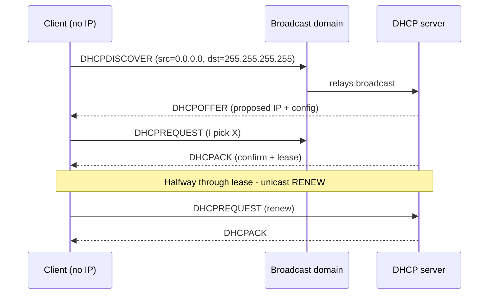

<KeyIdea>
**In one line**: DHCP lets a **freshly-connected device** automatically receive an **IP address, subnet mask, gateway, and DNS** without manual config. It runs over UDP, ports **67 (server) / 68 (client)**.
</KeyIdea>

## What it is

The classic four-step handshake — **DORA**:

```
1. Discover (broadcast) : client → "any DHCP servers around?"
2. Offer    (uni/bcast) : server → "you can have 192.168.1.50 + gateway + DNS + 24h lease"
3. Request  (broadcast) : client → "I accept X's offer" (picks one when multiple servers)
4. ACK      (uni/bcast) : server → "confirmed"
```

After that the client may use the IP. **Halfway through the lease**, the client unicasts a renew to the same server.

## Analogy

<Analogy>
DHCP = **the hotel front desk**: present your ID (MAC) → desk hands you a room number (IP) + key code + floor map (subnet mask + gateway + DNS) + **check-out time** (lease). Renew before check-out.
</Analogy>

## Key concepts

<Terms items={[
  { term: "Lease", en: "Lease", def: "How long the IP is loaned; expires unless renewed. Home routers default to ~24h; enterprise may use 1h." },
  { term: "Reservation", en: "Reservation", def: "Bind a MAC to a specific IP — common for servers / printers." },
  { term: "Scope / Pool", en: "Scope / Pool", def: "Range the DHCP server can hand out, e.g. 192.168.1.100-200." },
  { term: "DHCP Relay", en: "DHCP Relay", def: "Because DHCP is broadcast, routers must forward Discover packets to a central DHCP server across subnets." },
  { term: "DHCPv6 / SLAAC", en: "IPv6 auto-config", def: "IPv6 supports DHCPv6 or SLAAC — router advertises a prefix and hosts derive their own IP." },
  { term: "Option 43 / 60 / 66", en: "DHCP Options", def: "Deliver extras: PXE boot, TFTP server, domain, NTP, etc." },
]} />

## How it works



Across subnets, routers run **DHCP relay (ip helper-address)** to unicast broadcasts to the central server.

## Practical notes

- **`ip a` / `ipconfig /all`** — check if the IP came from DHCP (look for the DHCP server field).
- **Renew / re-request**: Linux `dhclient -r && dhclient`; Windows `ipconfig /release && /renew`; macOS "Renew DHCP Lease".
- **`169.254.x.x` (APIPA)** — fallback link-local address. **Seeing this means DHCP failed**.
- **Servers**: home routers ship a built-in one; enterprise uses ISC DHCP / Kea / Windows Server / RouterOS.
- **PXE network boot**: DHCP option 66/67 tells clients the TFTP server and boot file.
- **Security**: **DHCP Snooping** on switches identifies legitimate DHCP servers and blocks rogue ones.
- **Static vs DHCP**: prefer **reservations** for servers / printers / monitoring — stable yet centrally manageable.

## Easy confusions

<Compare
  leftTitle="DHCP"
  rightTitle="DNS"
  left={<>
    **Receive IP config** (address, gateway, DNS).<br />
    The step before you go online.
  </>}
  right={<>
    **Resolve domain → IP**.<br />
    Used on every connection.
  </>}
/>

## Further reading

- [IP addresses](/network/beginner/ip-address)
- [Subnet & CIDR](/network/beginner/subnet-cidr)
- [DNS](/network/beginner/dns)
