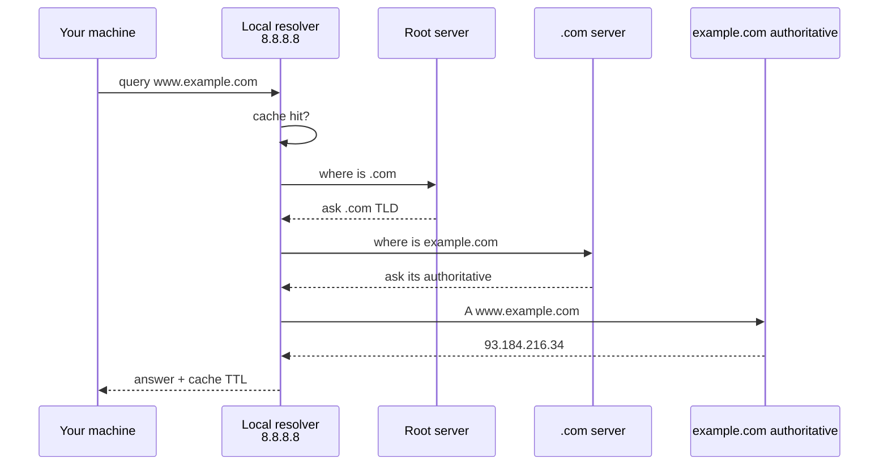

<KeyIdea>
**In one line**: **DNS** translates `www.example.com` (memorable for humans) into **`93.184.216.34` (usable by machines)**. Every domain access starts with a DNS query.
</KeyIdea>

## What it is

DNS is a **globally distributed database** organised hierarchically:

```
. (root)
└── com (top-level domain, TLD)
    └── example.com (second-level)
        ├── www.example.com  → A record → 93.184.216.34
        └── mail.example.com → A record → 93.184.216.50
```

When your machine queries, it walks up the tree until it finds the answer.

## Analogy

<Analogy>
DNS is layered **address books**:
- You ask the front desk "how do I reach the head of marketing, Mr. Li?"
- They ask HQ, HQ asks the regional office…
- Eventually you get a phone number — then **cache it for next time**.
</Analogy>

## Key concepts

<Terms items={[
  { term: "A record", en: "A Record", def: "Domain → IPv4 address. Most common." },
  { term: "AAAA record", en: "AAAA Record", def: "Domain → IPv6 address." },
  { term: "CNAME", en: "Canonical Name", def: "Domain → another domain (alias). Common with CDNs." },
  { term: "MX", en: "Mail Exchange", def: "Mail-receiving server for the domain." },
  { term: "TXT", en: "TXT Record", def: "Arbitrary text, often for domain verification / SPF / DKIM." },
  { term: "TTL", en: "Time To Live", def: "Cache duration in seconds — determines how fast a change propagates." },
  { term: "Recursive query", en: "Recursive", def: "You ask once; the resolver does the full walk for you." },
]} />

## How it works



In practice most queries **hit the local resolver cache**, not the full path.

## Practical notes

- **`dig www.example.com`** is the standard debug tool. On Windows: `nslookup`.
- **`dig +trace`** walks the full path from root.
- **DNS changes don't apply instantly.** Wait for TTL. **Lower TTL** (e.g. 60 s) hours before changing.
- **Public DNS**: 1.1.1.1 (Cloudflare), 8.8.8.8 (Google), 223.5.5.5 (Alibaba).
- **DoH / DoT**: DNS over HTTPS / TLS, encrypts queries; avoids ISP hijacking and snooping.
- **DNS poisoning**: some networks return wrong IPs — DoH or a different upstream resolver bypasses it.

## Easy confusions

<Compare
  leftTitle="Domain"
  rightTitle="URL"
  left={<>
    `example.com`<br />
    What DNS resolves.
  </>}
  right={<>
    `https://example.com/path?x=1`<br />
    Full resource locator.
  </>}
/>

## Further reading

- [HTTP](/network/beginner/http)
- [HTTPS](/network/beginner/https) / [TLS](/network/beginner/tls)
- [Cloudflare](/network/ecosystem/cloudflare) — integrates authoritative + recursive DNS
