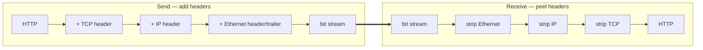

<KeyIdea>
**In one line**: Going down the stack from the application layer, **each layer adds its own header** (sometimes a trailer) around the data; the receiver peels them off one by one. This is **encapsulation / de-encapsulation**.
</KeyIdea>

## What it is

The application writes some bytes — say an HTTP request:

```
GET /index.html HTTP/1.1
Host: example.com
```

This doesn't fly on the wire "naked". Going down:

```
HTTP message                                                ← Application
[TCP header | HTTP message]                                 ← Transport
[IP header | TCP header | HTTP message]                     ← Network
[Ethernet header | IP header | TCP header | HTTP | Ethernet trailer]  ← Link
bit stream                                                  ← Physical
```

Each header **tells the next layer how to process the packet**.

## Analogy

<Analogy>
You write a letter (HTTP), put it in **envelope 1** (TCP, with port number); put that in **envelope 2** (IP, with final address); the courier wraps a third **envelope 3** (Ethernet, with this-hop addresses). Each relay station only opens the **outermost** to know where the next hop goes — never the inner ones.
</Analogy>

## Key concepts

<Terms items={[
  { term: "Frame", en: "Frame", def: "Link-layer PDU. Ethernet frame has src/dst MAC, type, CRC." },
  { term: "Packet", en: "Packet", def: "Network-layer PDU. IP has src/dst IP, TTL, protocol." },
  { term: "Segment", en: "Segment", def: "TCP PDU with ports, sequence, window. UDP calls it a datagram." },
  { term: "MTU", en: "Max Transmission Unit", def: "Largest frame the link layer can send (Ethernet default 1500). Larger requires fragmentation." },
  { term: "Payload", en: "Payload", def: "What follows the layer's header — the actual data being carried." },
]} />

## How it works



Every router rewrites the **Ethernet header** (next hop changes) but **leaves IP and above alone**.

## Practical notes

- **Mismatched MTU causes pain.** IP fragments when needed. VPN/tunnels often shrink MTU, hurting TCP. Use `ping -s 1472 -M do` to probe the max no-fragment size.
- **Packet capture is layer view.** Wireshark expands each packet by frame / IP / TCP / HTTP — **the manual peel-and-show**.
- **Each layer has a length limit.** Ethernet 1500, IP up to 65535 in theory, TCP segment bounded by MSS.
- **Where encryption happens matters.** HTTPS sits between app and transport; the link layer sees only ciphertext — but **IP headers remain plaintext**, so the ISP still sees which IP you contact.

## Easy confusions

<Compare
  leftTitle="Header"
  rightTitle="Trailer"
  left={<>
    Most protocols only add a header.<br />
    e.g. IP, TCP.
  </>}
  right={<>
    Link layer (Ethernet) appends a 4-byte CRC trailer.
  </>}
/>

## Further reading

- [OSI](/network/beginner/osi-model) / [TCP/IP](/network/beginner/tcpip-model)
- [IP Address & Subnet](/network/beginner/ip-address)
- [TCP vs UDP](/network/beginner/tcp-vs-udp)
