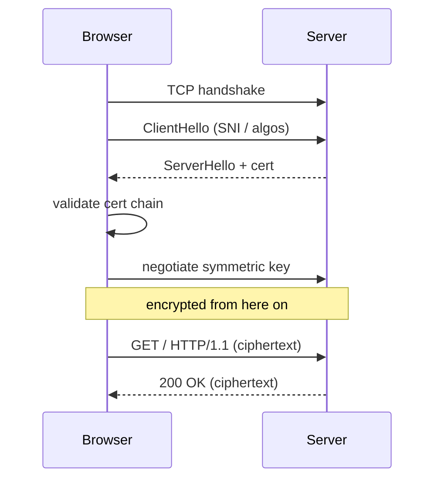

<KeyIdea>
**In one line**: **HTTPS = HTTP over TLS**. It pushes HTTP's plaintext traffic through a TLS-protected encrypted channel — so ISPs / public Wi-Fi can't read the body or alter responses — and uses certificates to authenticate the server.
</KeyIdea>

## What it is

```
HTTP:   [TCP]────[HTTP plaintext]
HTTPS:  [TCP]────[TLS encrypted]────[HTTP]
```

After the TCP handshake, TLS performs its own handshake — exchange keys, validate the certificate, negotiate algorithms — and bidirectional traffic is then symmetrically encrypted.

## Analogy

<Analogy>
HTTP is a **postcard** anyone on the route can read. HTTPS is a **safe**: both parties exchange keys during the handshake, then every letter is locked inside before posting — passers-by **see only the locked safe**.
</Analogy>

## Key concepts

<Terms items={[
  { term: "Certificate", en: "Certificate", def: "An X.509 file containing a domain, public key, and issuer — proves 'this public key belongs to this domain'." },
  { term: "CA", en: "Certificate Authority", def: "Cert issuer. Browsers ship a trust list (Let's Encrypt, DigiCert, etc.)." },
  { term: "SNI", en: "Server Name Indication", def: "Client tells the server which domain to serve during the TLS handshake — essential for one-IP-many-certs." },
  { term: "HSTS", en: "HTTP Strict Transport Security", def: "Server tells browsers 'always use HTTPS for me from now on'." },
  { term: "Mixed content", en: "Mixed Content", def: "An HTTPS page that loads HTTP resources — the browser blocks them." },
]} />

## How it works



TLS 1.3 compresses the handshake to 1-RTT, with optional 0-RTT resumption — a big speedup.

## Practical notes

- **Let's Encrypt + ACME**: free certificates, auto-renewed every 90 days. Caddy / Traefik handle this natively; nginx pairs with certbot.
- **Expired certs are the #1 outage cause.** Alert 7–14 days early.
- **`curl -v https://...`** shows TLS version, cipher, certificate.
- **`openssl s_client -connect host:443 -servername host`** debugs cert / SNI issues.
- **Mixed content**: an HTTPS page loading HTTP assets is blocked. **All-HTTPS sites** avoid this.
- **HSTS preload**: submit your domain to the browser-builtin list to **enforce HTTPS forever**.

## Easy confusions

<Compare
  leftTitle="HTTPS"
  rightTitle="VPN"
  left={<>
    Encrypts only **a single HTTP connection**.<br />
    SNI / IP still leak.
  </>}
  right={<>
    Encrypts **all** traffic to a VPN server.<br />
    ISPs see only "you connected to a VPN".
  </>}
/>

## Further reading

- [HTTP Basics](/network/beginner/http)
- [TLS](/network/beginner/tls)
- [TLS Handshake (deep dive)](/network/advanced/tls-handshake)
- [DNS](/network/beginner/dns)
