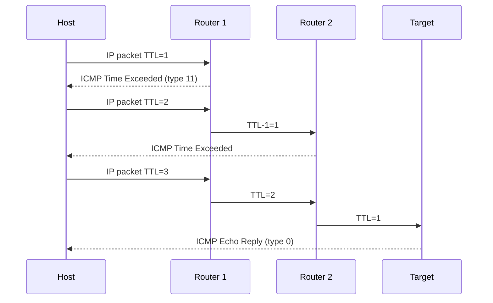

<KeyIdea>
**In one line**: **ICMP** rides directly on IP (no TCP/UDP) and exists for **control and diagnostics**: route-unreachable, TTL expiry, ping probes. **It carries no application data** — it is the network's "support desk + health-check" channel.
</KeyIdea>

## What it is

ICMP messages are the payload of IP packets (protocol number `1`; IPv6 uses `58`, called ICMPv6):

```
IP header(protocol=1) | ICMP header(type, code) | data
```

Common types:

```
type 0   Echo Reply         ← Ping response
type 8   Echo Request       ← Ping request
type 3   Destination Unreachable  (code 0=net, 1=host, 3=port, 4=fragmentation needed but DF set)
type 11  Time Exceeded      ← TTL expired, traceroute relies on this
type 5   Redirect           ← Router says "use a different gateway"
```

## Analogy

<Analogy>
IP / TCP = **the courier service**; ICMP = **customer service** — calls you when "address doesn't exist" / "floor too high" / "let me test if this is reachable". **ICMP itself doesn't ship anything**.
</Analogy>

## Key concepts

<Terms items={[
  { term: "Echo Request / Reply", en: "Echo Request / Reply", def: "Used by ping (types 8 / 0)." },
  { term: "Destination Unreachable", en: "Destination Unreachable", def: "type 3 + codes — net / host / port / protocol unreachable." },
  { term: "Time Exceeded", en: "Time Exceeded", def: "type 11; traceroute exploits it to reveal each intermediate router." },
  { term: "Redirect", en: "Redirect", def: "type 5; router suggests a different gateway. Often disabled in modern networks (abuse risk)." },
  { term: "PMTUD", en: "Path MTU Discovery", def: "Relies on type 3 code 4. Firewalls mistakenly blocking it cause a 'black hole'." },
  { term: "ICMPv6", en: "ICMPv6", def: "Mandatory in IPv6 — carries Neighbor Discovery + Router Advertisement; **must not be blocked**." },
]} />

## How it works



Traceroute deliberately **starves TTL one hop at a time** — each Time-Exceeded reveals the next router on the path.

## Practical notes

- **`ping`** uses ICMP type 8/0; a server refusing ping doesn't mean it's offline — it may just block ICMP.
- **Don't blanket-block ICMP**: blocking type 3 code 4 (PMTUD) creates a black hole — small packets pass, large ones drop. Blocking ICMPv6 breaks IPv6 entirely.
- **Transport-level alternatives**: `tcping` / `nc -zv host port` / `mtr --tcp` work in ICMP-blocked networks.
- **Risk**: **ICMP tunnels** (smuggling data in echo payloads) are used for exfiltration — egress firewalls should rate-limit + DPI.
- **Standard triage**: `ping → traceroute → mtr → tcpdump icmp` is the classic four-step path.

## Easy confusions

<Compare
  leftTitle="ICMP"
  rightTitle="UDP / TCP"
  left={<>
    **Network-layer** control signaling.<br />
    No ports; no application payload.
  </>}
  right={<>
    **Transport-layer** application communication.<br />
    Ports + actual payloads.
  </>}
/>

## Further reading

- [Ping](/network/beginner/ping)
- [Traceroute](/network/beginner/traceroute)
- [IP addresses](/network/beginner/ip-address)
