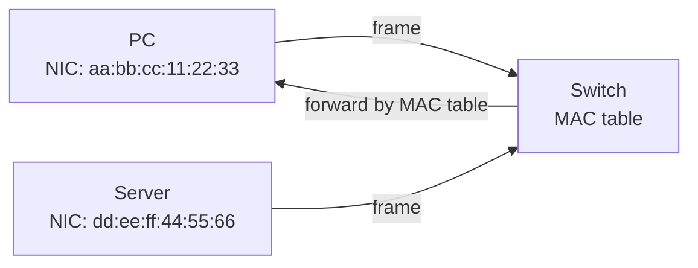

<KeyIdea>
**In one line**: A MAC address is a 6-byte (48-bit) hardware identifier **burned into the NIC**, written as `aa:bb:cc:dd:ee:ff`. It's used for addressing **within a single layer-2 broadcast domain**; it has no meaning across subnets.
</KeyIdea>

## What it is

```
aa:bb:cc:dd:ee:ff
└─ OUI ──┘ └─ vendor-internal ──┘
   24 bits     24 bits
```

- The first 24 bits, **OUI** (Organizationally Unique Identifier), are assigned by IEEE: Apple, Intel, Huawei each have prefixes.
- The last 24 bits are vendor-managed.
- Theoretically globally unique; in practice can be changed in software.

## Analogy

<Analogy>
**IP** is your **room number** (you can switch rooms); **MAC** is your **ID card number** (issued at the factory). But ID numbers can be forged too — **don't treat MAC as trustworthy identity**.
</Analogy>

## Key concepts

<Terms items={[
  { term: "Unicast MAC", en: "Unicast", def: "First-byte LSB = 0; addressed to a specific host." },
  { term: "Multicast MAC", en: "Multicast", def: "First-byte LSB = 1; to a group. e.g. IPv6 ND uses 33:33:xx:xx:xx:xx." },
  { term: "Broadcast MAC", en: "Broadcast", def: "ff:ff:ff:ff:ff:ff — every host on the subnet." },
  { term: "Local / global", en: "U/L bit", def: "Second-lowest bit of byte 1: 0 = vendor-burned, 1 = locally administered (e.g. VM virtual NICs)." },
  { term: "MAC randomisation", en: "MAC Randomization", def: "iOS / Android use random MACs while probing Wi-Fi to avoid tracking." },
]} />

## How it works



The switch reads the **destination MAC** of each frame:
- in MAC table → forward to that port;
- not in MAC table → flood to all ports (except source).

## Practical notes

- **`ip link show` / `ifconfig`** show local MAC.
- **Change MAC**: `ip link set eth0 address xx:xx:xx:xx:xx:xx`.
- **MAC flapping**: same MAC seen on multiple ports — usually a loop / shared NIC; **switches alarm**.
- **MAC table aging**: 5 min default; idle entries get removed.
- **Privacy**: phones use random MACs while scanning Wi-Fi (iOS default), then use the real MAC after associating (depends on settings).

## Easy confusions

<Compare
  leftTitle="IP"
  rightTitle="MAC"
  left={<>
    **Logical address**, mutable.<br />
    For inter-subnet routing.
  </>}
  right={<>
    **Physical address**, on the NIC.<br />
    Only meaningful within a subnet.
  </>}
/>

## Further reading

- [ARP](/network/beginner/arp) — given IP, find MAC
- [Physical & Link Layer](/network/beginner/physical-link)
- [IP Address](/network/beginner/ip-address)
