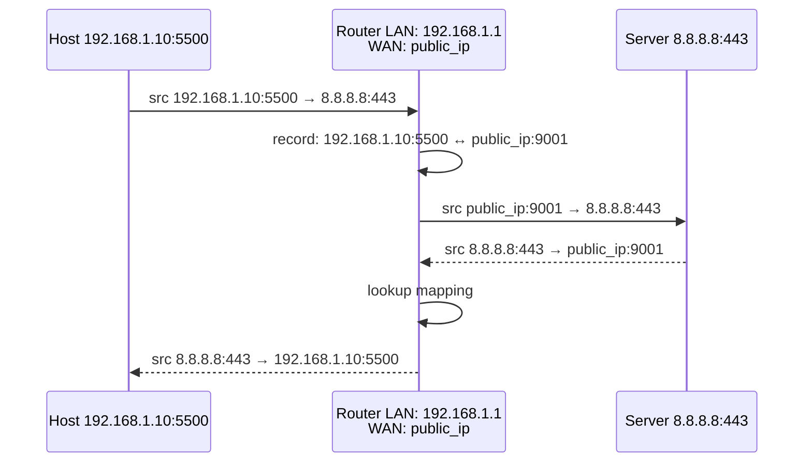

<KeyIdea>
**In one line**: **NAT** **temporarily replaces a LAN's private IP** (`192.168.x.x`) with a public IP when leaving, and reverses on return — the key reason IPv4 still scales today.
</KeyIdea>

## What it is

A home router (a.k.a. gateway):

```
On LAN:    192.168.1.10:5500 → 8.8.8.8:443
              ↓ NAT rewrite
On WAN:    public_ip:external_port → 8.8.8.8:443
              ← reverse rewrite on return
```

Ten devices use the same public IP at once; the router uses the **external port** to demux who's who — this many-to-one variant is **NAPT / PAT** (port address translation), which dominates today.

## Analogy

<Analogy>
A company switchboard: outside callers see one company number; the receptionist routes by **extension** to find the right employee. NAT is the router playing receptionist.
</Analogy>

## Key concepts

<Terms items={[
  { term: "SNAT", en: "Source NAT", def: "Rewrites source IP — private→public on egress. Default behaviour on home routers." },
  { term: "DNAT", en: "Destination NAT", def: "Rewrites destination IP — public→private on return; used for port-forwarding / exposing services." },
  { term: "NAPT / PAT", en: "Port Address Translation", def: "Many-to-one NAT using port numbers to distinguish hosts. The only feasible home-router approach." },
  { term: "NAT type", en: "Cone / Symmetric", def: "Affects P2P hole-punching difficulty. Symmetric is strictest, often unreachable." },
  { term: "Port forwarding", en: "Port Forwarding", def: "A flavour of DNAT: router maps `public:8080 → 192.168.1.5:80`." },
]} />

## How it works



Each NAT mapping is a **session entry**; closed TCP connections / idle UDP entries **get cleared after a timeout**.

## Practical notes

- **Outbound from LAN**: auto-created entry, just works.
- **Inbound from WAN**: blocked by default; need **port-forwarding** or a **reverse tunnel** (frp / ngrok / Cloudflare Tunnel).
- **P2P hole punching**: both sides UDP-blast each other's "public IP:port" coordinated by a STUN/TURN server, so each NAT creates an entry — that's STUN / TURN's job.
- **NAT impacts gaming / VoIP.** "**Strict NAT type**" usually means Symmetric NAT and peers can't reach you.
- **CGNAT** (carrier-grade NAT): many home connections don't even get a public IP — **multiple users share one** — self-hosted services must use a tunnel.

## Easy confusions

<Compare
  leftTitle="NAT"
  rightTitle="Proxy"
  left={<>
    **Network layer** rewriting addresses.<br />
    Apps unaware.
  </>}
  right={<>
    **Application layer** relaying data.<br />
    App must know about it (HTTP_PROXY etc.).
  </>}
/>

## Further reading

- [IP Address](/network/beginner/ip-address)
- [Subnet & CIDR](/network/beginner/subnet-cidr)
- [WireGuard / Tailscale](/network/ecosystem/wireguard-tailscale) — modern NAT-traversal
