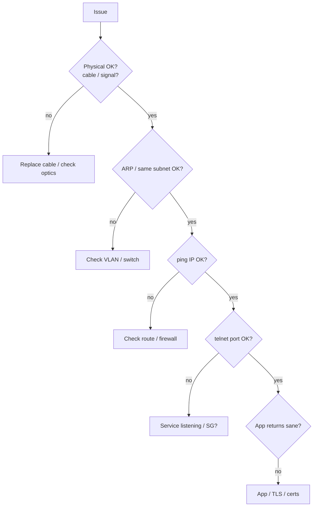

<KeyIdea>
**In one line**: The OSI 7-layer model splits networking from "light signals" to "application semantics" into seven layers — physical / link / network / transport / session / presentation / application. **Each layer uses only the one below.** It's a **theoretical model**; in practice most vendors run a TCP/IP 5-layer stack.
</KeyIdea>

## One-line per layer

| Layer | Name | Job | Examples |
| --- | --- | --- | --- |
| 7 | Application | Business semantics | HTTP / SMTP / DNS / SSH |
| 6 | Presentation | Encoding / encryption / compression | TLS (partly) / JPEG / ASCII |
| 5 | Session | Establish / maintain sessions | RPC sessions, SQL sessions |
| 4 | Transport | End-to-end reliable or fast | TCP / UDP |
| 3 | Network | Inter-subnet routing | IP / ICMP / OSPF |
| 2 | Data Link | Same-link transport | Ethernet / Wi-Fi / PPP |
| 1 | Physical | Bits → signals | Copper / fibre / radio |

## Analogy

<Analogy>
Sending a letter:
- Physical = postal trucks / roads;
- Link = local courier;
- Network = inter-city postal routing;
- Transport = "guaranteed signature" (TCP) vs "lose-it-don't-care" (UDP);
- Session = "this is our ongoing conversation";
- Presentation = translation / encryption;
- Application = the contents of the letter.
</Analogy>

## Why 5 and 6 are "blurry in practice"

**Presentation and session** layers have basically no standalone protocols in TCP/IP. Their functions:
- Presentation → handled by **application protocols themselves** (HTTP `Content-Encoding` / `Content-Type`, TLS encryption).
- Session → handled jointly by **app + transport** (HTTP cookies, TLS session resume).

So **engineering's TCP/IP model has only 5 layers (sometimes merged to 4)**.

## Key concepts

<Terms items={[
  { term: "Encapsulation", en: "Encapsulation", def: "Each layer adds its header on the way down." },
  { term: "De-encapsulation", en: "De-encapsulation", def: "Each layer peels its header on the way up." },
  { term: "PDU", en: "Protocol Data Unit", def: "Each layer's name for its unit: bit / frame / packet / segment / message." },
  { term: "Peer-to-peer", en: "Peer-to-peer", def: "Endpoints talk logically at the same layer; lower layers are just couriers." },
]} />

## Troubleshooting with the OSI model

**Layered debugging** = bottom-up, eliminate each layer before moving up.

## Practical notes

- **The OSI 7 layers describe; they don't dictate implementation.**
- **In practice use TCP/IP**: physical / link / network / transport / application.
- **"L4 / L7" are everyday terms**: load balancers schedule by L4 (ports) or L7 (HTTP) — **commonly asked in interviews**.
- **Wireshark / tcpdump expand by layer** — OSI is the best frame of reference for capture analysis.

## Easy confusions

<Compare
  leftTitle="OSI 7 layers"
  rightTitle="TCP/IP 5 layers"
  left={<>
    Teaching model, theoretically clean. 
    Presentation / session aren't separately implemented.
  </>}
  right={<>
    Engineering model. 
    What the real internet runs on.
  </>}
/>

## Further reading

- [TCP/IP Model](/network/beginner/tcpip-model)
- [Encapsulation](/network/beginner/encapsulation)
- [Physical & Link Layer](/network/beginner/physical-link)
