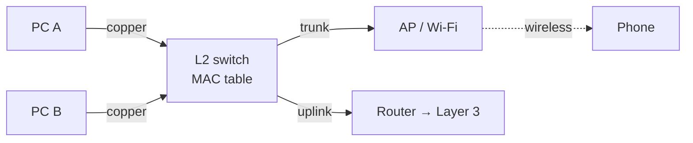

<KeyIdea>
**In one line**: The physical layer **turns bits into electrical / optical / radio signals**; the link layer **delivers a frame to the next hop within a single LAN / Wi-Fi range**.
</KeyIdea>

## What it is

- **Physical layer**: voltage, modulation, light intensity, RF power — how `0` and `1` cross the medium.
- **Link layer**: Ethernet / Wi-Fi frame format; CRC; MAC addressing; half / full duplex.

```
[Wi-Fi frame / Ethernet frame]   ← Link
        ↓
[Bit-level signal]               ← Physical (copper / fibre / 2.4/5/6 GHz)
```

## Analogy

<Analogy>
**Physical layer** = **the road** (asphalt, highway).  
**Link layer** = **the courier on one street**: only cares about delivering from this address to that one — couldn't care less how far away the final destination is. That's the network layer's (router's) job.
</Analogy>

## Key concepts

<Terms items={[
  { term: "Ethernet", en: "Ethernet", def: "Mainstream wired LAN. 10M / 100M / 1G / 10G / 25G / 100G. RJ45 + twisted pair / optical modules." },
  { term: "Wi-Fi", en: "Wireless LAN", def: "IEEE 802.11. a/b/g/n/ac/ax/be evolution improves speed and interference tolerance." },
  { term: "Switch", en: "Switch", def: "Layer-2 device; uses a MAC table to forward frames only to the right port (unlike a hub)." },
  { term: "VLAN", en: "Virtual LAN", def: "Splits a switch into multiple logical broadcast domains. A single uplink can carry multiple VLANs (trunk)." },
  { term: "MTU", en: "Max Transmission Unit", def: "Ethernet default 1500 bytes; jumbo frames 9000." },
  { term: "Full duplex", en: "Full Duplex", def: "Send and receive simultaneously; default on modern switch ports." },
]} />

## How it works



A frame arrives → switch looks up its MAC table → finds destination's port → forwards only there. **If unknown, flood** (everywhere except source port).

## Practical notes

- **Cable categories**: Cat5e (1G) → Cat6 (1G/2.5G/10G short) → Cat6a (10G) → Cat7/8 (data centres). Cat6 is enough at home.
- **Optical modules**: SFP (1G) / SFP+ (10G) / SFP28 (25G) / QSFP+ (40G) / QSFP28 (100G). Match your switch's port.
- **Prefer 5/6 GHz Wi-Fi.** 2.4 GHz is crowded but penetrates walls; 5/6 GHz is clean, fast, weaker through walls.
- **Both sides of a link must agree on MTU.** Mismatch drops large packets. Inside a VPN, ~1420 is a safe MTU.
- **Half-duplex is gone.** Only old gear; **don't manually set half-duplex**.

## Easy confusions

<Compare
  leftTitle="Hub"
  rightTitle="Switch"
  left={<>
    Forwards every frame to every port; **collision domain shared**.<br />
    Practically extinct.
  </>}
  right={<>
    Forwards by MAC table.<br />
    Each port is its own collision domain.
  </>}
/>

## Further reading

- [OSI](/network/beginner/osi-model) / [TCP/IP](/network/beginner/tcpip-model)
- [MAC addresses](/network/beginner/mac-address) / [ARP](/network/beginner/arp)
- [Subnet & CIDR](/network/beginner/subnet-cidr)
