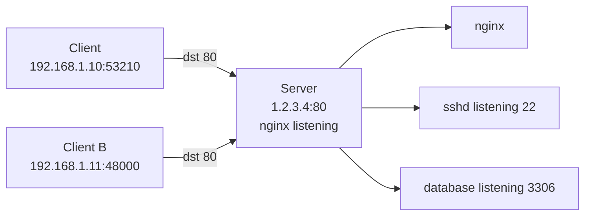

<KeyIdea>
**In one line**: A **port** is a 16-bit integer (0–65535). **IP finds the host; port finds the service on that host.** A connection is uniquely identified by a 5-tuple: **protocol + source IP + source port + destination IP + destination port**.
</KeyIdea>

## What it is

A host might run web, SSH, database, Redis simultaneously… how does the OS know who an incoming packet belongs to? The port.

```
Visit https://example.com
  → default destination port 443 (HTTPS)
  → your machine picks a free local port as the source (e.g. 53210)
  → server sees "dst 443" and routes to nginx
```

## Analogy

<Analogy>
**IP** = **office building address**; **port** = **extension at a specific tenant's front desk**. One building hosts many companies; each has its own extension.
</Analogy>

## Key concepts

<Terms items={[
  { term: "Well-known", en: "Well-known", def: "0–1023, reserved for standards (HTTP 80, HTTPS 443, SSH 22, DNS 53). On Linux, non-root can't bind by default." },
  { term: "Registered", en: "Registered", def: "1024–49151, vendor-registered with IANA (MySQL 3306, PostgreSQL 5432, Redis 6379)." },
  { term: "Ephemeral", en: "Ephemeral", def: "49152–65535 (Linux default 32768–60999); allocated by OS for outbound connections." },
  { term: "5-tuple", en: "5-tuple", def: "(protocol, src IP, src port, dst IP, dst port) — uniquely identifies a connection." },
  { term: "Listen vs connect", en: "Listen vs Connect", def: "Server listens on a port; the client's local port is auto-assigned by the OS at connect time." },
]} />

## How it works



The same server port can be connected by **many clients at once** — different 5-tuples (different src IP / port) = different connections.

## Practical notes

- **`netstat -tlnp` / `ss -tlnp`**: which ports am I listening on?
- **`lsof -i :3000`**: who's using port 3000?
- **Bind 0.0.0.0 vs 127.0.0.1**: the former exposes externally, the latter is local-only — **mind production**.
- **Port conflicts**: before launching a service, `ss -ltn | grep :3000`; if taken, change port or kill the process.
- **Below 1024 needs root** by default. `setcap` or iptables redirect 80→8080 are common workarounds.

## Easy confusions

<Compare
  leftTitle="One port, many connections"
  rightTitle="Port conflict"
  left={<>
    Server listens on 80, **N clients connect**.<br />
    Each connection's 5-tuple differs = different sockets.
  </>}
  right={<>
    **Two processes** both `listen` on 80.<br />
    The second errors `Address already in use`.
  </>}
/>

## Further reading

- [TCP vs UDP](/network/beginner/tcp-vs-udp)
- [TCP 3-way Handshake](/network/advanced/tcp-handshake)
- [NAT](/network/beginner/nat) — NAT rewrites these port numbers
