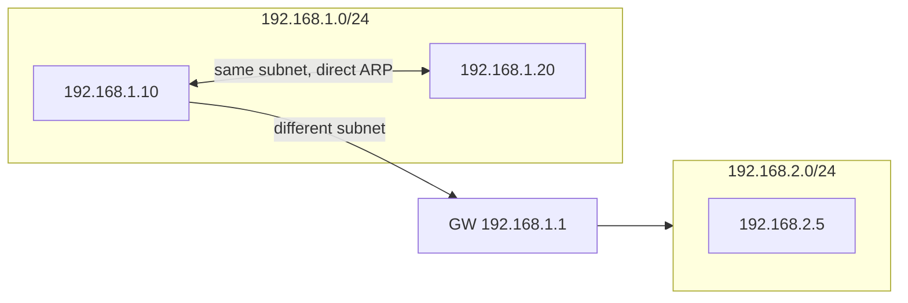

<KeyIdea>
**In one line**: A **subnet mask** tells a host "**these high bits are the network part, the rest are the host part**". CIDR writes `/N` for the first N network bits — **forget A/B/C classes** in modern networking.
</KeyIdea>

## What it is

In `192.168.1.10/24`:

- The leading 24 bits (`192.168.1`) are the **network part** — shared by all hosts on that subnet;
- The last 8 bits (`.10`) are the **host part** — distinguishes hosts on that subnet.

```
192.168.1.10/24 in binary:
  11000000.10101000.00000001 . 00001010
  └────── network (24 bits) ──┘ └ host (8) ┘
```

The whole subnet `192.168.1.0/24` has 256 addresses; first and last are reserved (`.0` = network address, `.255` = broadcast). **254 usable.**

## Analogy

<Analogy>
A **postal code** like `100000` for Beijing — leading digits identify the region, trailing digits the building. The subnet mask is the ruler that tells you **how many leading digits represent the region**.
</Analogy>

## Key concepts

<Terms items={[
  { term: "Subnet mask", en: "Subnet mask", def: "Same length as the IP (32 bits); 1s = network bits, 0s = host bits. /24 = 255.255.255.0." },
  { term: "CIDR notation", en: "Classless Inter-Domain Routing", def: "Write IP/prefix-length, e.g. 10.0.0.0/8, 172.16.0.0/12." },
  { term: "Network address", en: "Network address", def: "All host bits zero; identifies the subnet, not assigned to a host." },
  { term: "Broadcast address", en: "Broadcast address", def: "All host bits one; reaches everyone on the subnet." },
  { term: "Usable hosts", en: "Usable hosts", def: "2^host_bits - 2 (subtract network + broadcast)." },
]} />

## How it works



A host applies its **subnet mask** to decide whether the destination is in **the same subnet**: yes → ARP directly; no → send to the default gateway.

## Practical notes

- **CIDR cheatsheet**:

| CIDR | Mask              | Usable hosts |
| ---- | ----------------- | ------------ |
| /24  | 255.255.255.0     | 254          |
| /25  | 255.255.255.128   | 126          |
| /26  | 255.255.255.192   | 62           |
| /28  | 255.255.255.240   | 14           |
| /30  | 255.255.255.252   | 2 (point-to-point) |

- **`/32`** = a single host — common in routing-table specifics.
- **`/0`** = "all IPs"; the default route `0.0.0.0/0`.
- **Don't compute by hand**: use `ipcalc 192.168.1.0/26` to print network / broadcast / range.
- **Smaller subnets save addresses but bloat routing tables.** In practice, slicing by `/24` per business unit balances **manageability over conservation**.

## Easy confusions

<Compare
  leftTitle="A / B / C classes"
  rightTitle="CIDR"
  left={<>
    Early fixed split: A=/8, B=/16, C=/24.<br />
    Too coarse and wasteful — **deprecated**.
  </>}
  right={<>
    Arbitrary prefix length /N.<br />
    The modern internet's scheme.
  </>}
/>

## Further reading

- [IP Address](/network/beginner/ip-address)
- [NAT](/network/beginner/nat)
- [TCP vs UDP](/network/beginner/tcp-vs-udp)
