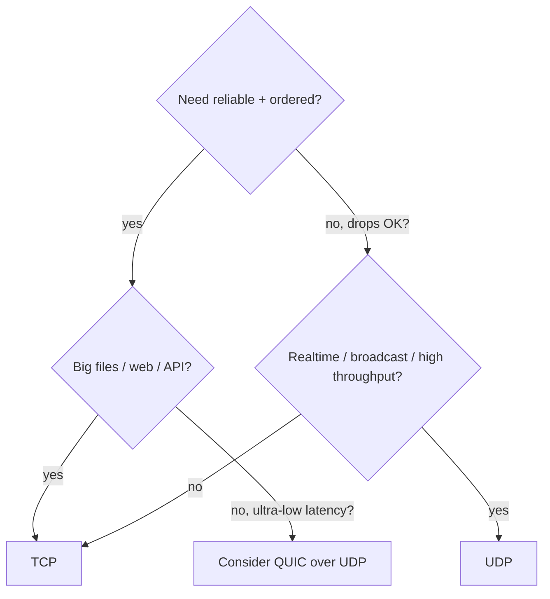

<KeyIdea>
**In one line**: TCP gives you **reliability**; UDP gives you **simplicity + realtime**. "Must arrive in order" → TCP. "Low latency, drops OK" → UDP. **HTTP/3 picks UDP** because it implements reliability inside QUIC.
</KeyIdea>

## Side-by-side

| Dimension | TCP | UDP |
| --- | --- | --- |
| Connection | 3-way handshake | None |
| Reliability | SEQ + ACK + retransmit | None |
| Order | Guaranteed | Not guaranteed |
| Flow control | Sliding window | None |
| Congestion control | Reno / CUBIC / BBR | None (app-level) |
| Data shape | Byte stream (no boundary) | Datagram (boundaried) |
| Header | 20+ bytes | 8 bytes |
| Broadcast / Multicast | Not supported | Native |
| Typical protocols | HTTP/1/2, SSH, SMTP, DB, TLS | DNS, DHCP, NTP, VoIP, QUIC |
| NAT-friendliness | Easy (router watches SYN/FIN) | Harder (relies on timeouts) |

## Choosing

## Rules of thumb

- **HTTP/1/2, SSH, SMTP, IMAP, DB connections**: TCP.
- **DNS, DHCP, NTP**: UDP (light, single Q&A).
- **VoIP / video conferencing / live streams / games**: UDP, lost frames don't matter much.
- **HTTP/3**: QUIC over UDP — wants reliability *and* avoidance of TCP head-of-line blocking.
- **Maximum throughput** (data-centre internal / high-frequency trading): UDP + custom reliability (KCP / DPDK).

## Easy confusions

<Compare
  leftTitle="TCP"
  rightTitle="UDP"
  left={<>
    Reliable + ordered + congestion-controlled. 
    Handshake overhead — **correctness first**.
  </>}
  right={<>
    Connectionless + no guarantees. 
    Zero handshake — **realtime first**.
  </>}
/>

## Further reading

- [TCP](/network/beginner/tcp)
- [UDP](/network/beginner/udp)
- [TCP 3-Way Handshake](/network/advanced/tcp-handshake)
- [HTTP/3 and QUIC](/network/advanced/http3-quic)
