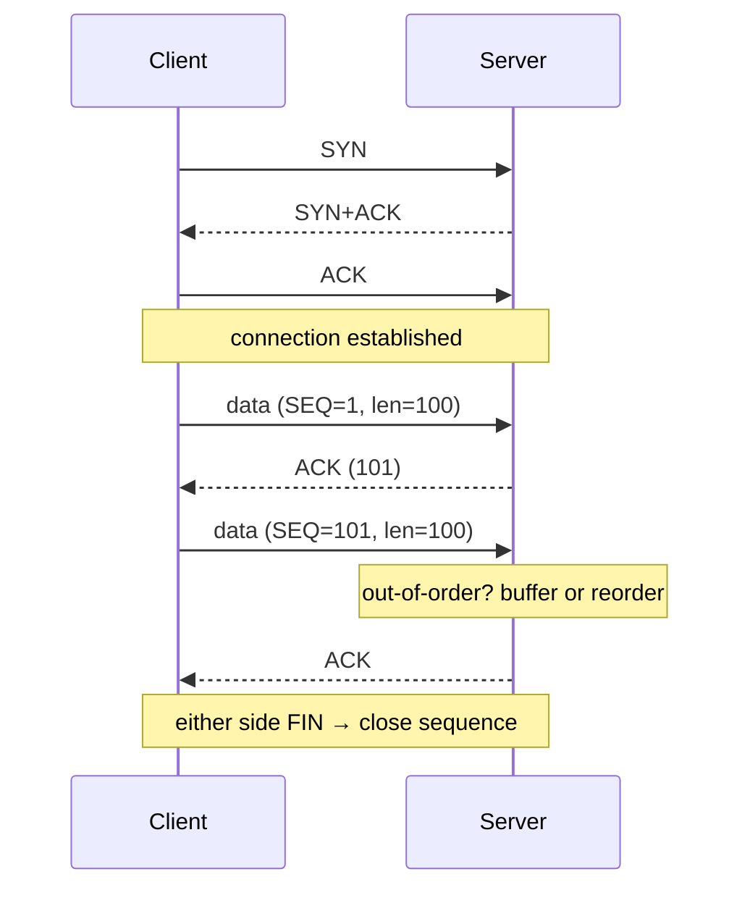

<KeyIdea>
**In one line**: **TCP** sets up a logical connection between two hosts and **delivers an upper-layer byte stream reliably and in order** — retransmits losses, slows down on congestion. It underpins HTTP/SSH/SMTP/databases and most other protocols.
</KeyIdea>

## What it is

TCP provides:
- **Connection-oriented**: 3-way handshake before data;
- **Reliable delivery**: sequence numbers + ACKs + retransmits;
- **In-order**: receiver reorders to send order;
- **Flow control**: sliding window, receiver tells sender "how much I can take";
- **Congestion control**: detect loss → slow down (Reno / CUBIC / BBR).

The cost is **handshake / retransmit overhead** — bad for real-time.

## Analogy

<Analogy>
**TCP** is a **registered letter**:
- Recipient signs (ACK);
- Lost in transit → courier resends (retransmit);
- Must arrive in order (sequence numbers);
- Recipient overloaded → tells you to slow down (sliding window).
</Analogy>

## Key concepts

<Terms items={[
  { term: "3-way handshake", en: "3-way handshake", def: "SYN → SYN+ACK → ACK to establish a connection. See the TCP handshake page." },
  { term: "4-way close", en: "4-way close", def: "FIN/ACK both directions to close." },
  { term: "SEQ / ACK", en: "SEQ / ACK", def: "Byte counters; receiver tells sender 'next byte expected'." },
  { term: "Sliding window", en: "Sliding window", def: "Receiver dynamically advertises 'still got X bytes' for flow control." },
  { term: "MSS", en: "Maximum Segment Size", def: "Max payload bytes per segment, often = MTU - 40." },
  { term: "Congestion control", en: "Congestion control", def: "Reno / CUBIC / BBR pace by loss / RTT." },
]} />

## How it works

The TCP header is at least 20 bytes — sequence, ack, window, checksum, flags (SYN / ACK / FIN / RST / PSH / URG).

## Practical notes

- **`ss -ti`** prints current congestion algorithm, RTT, cwnd per connection.
- **`sysctl net.ipv4.tcp_congestion_control`** changes default. BBR usually outperforms CUBIC on transoceanic links.
- **Lots of TIME_WAIT**: high-concurrency short-connection services accumulate them; tune `tcp_tw_reuse` or use long connections / pooling.
- **Half-open / accept queue full**: when a listener is overrun, SYNs get dropped; tune `somaxconn` and `tcp_max_syn_backlog`.
- **TCP keepalive**: 7200 s default is too long; long-connection services typically use 60–120 s.

## Easy confusions

<Compare
  leftTitle="TCP"
  rightTitle="UDP"
  left={<>
    Connection-oriented, reliable, ordered, congestion-controlled. 
    Handshake + retransmit overhead.
  </>}
  right={<>
    Connectionless, no guarantees, no order, no congestion control. 
    Zero overhead — fits real-time.
  </>}
/>

## Further reading

- [UDP](/network/beginner/udp)
- [TCP vs UDP comparison](/network/beginner/tcp-vs-udp)
- [TCP 3-Way Handshake](/network/advanced/tcp-handshake)
- [TCP State Machine](/network/advanced/tcp-state)
- [Congestion Control](/network/advanced/congestion-control)
