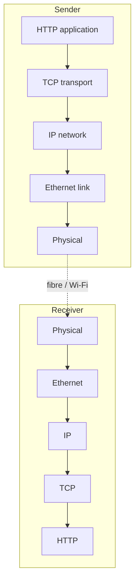

<KeyIdea>
**In one line**: The TCP/IP model is **what today's internet actually runs on**: application / transport / network / link / physical (sometimes "four layers" by merging link and physical). It **grew up from real protocols**, not from a design document.
</KeyIdea>

## Five layers at a glance

```
+---------------------+
| Application          | HTTP / DNS / SSH / SMTP / gRPC
+---------------------+
| Transport            | TCP / UDP / QUIC
+---------------------+
| Network              | IP / ICMP / routing protocols
+---------------------+
| Link                 | Ethernet / Wi-Fi / PPP
+---------------------+
| Physical             | Copper / fibre / radio
+---------------------+
```

## Why not seven

OSI defines application / presentation / session / transport / network / link / physical. **In TCP/IP**:
- No standalone session or presentation layer — their work is split between application (HTTP / TLS) and transport.
- Link and physical are conceptually distinct, but in practice are often spoken of together (one NIC).

## Analogy

<Analogy>
- OSI is like **theoretical physics**: symmetrical, beautiful.  
- TCP/IP is like **engineering physics**: gets the spaceship flying — **fewer layers, actually used**.
</Analogy>

## Key concepts

<Terms items={[
  { term: "Application", en: "Application", def: "Business semantics. HTTP / DNS / gRPC / SSH — protocols you call directly." },
  { term: "Transport", en: "Transport", def: "End-to-end 'reliable' (TCP) or 'unreliable but fast' (UDP)." },
  { term: "Network", en: "Network / Internet", def: "Inter-subnet routing. IP labels packets 'from where to where'." },
  { term: "Link", en: "Link", def: "Frames over a single physical link." },
  { term: "Physical", en: "Physical", def: "Bits and signals." },
]} />

## How it works



Each layer adds its header → receiver peels them off → hands to the application.

## Practical notes

- **Beginners only need TCP/IP's five layers**: physical / link / network / transport / application.
- **L4 / L7 are everyday terms**: load balancers route by L4 (ports) or L7 (HTTP) — **a common interview topic**.
- **Wireshark / tcpdump capture is broken down by these layers**.
- **Where does TLS sit?** Strictly "between application and transport"; engineering-wise easiest to think of as part of the application layer.

## Easy confusions

<Compare
  leftTitle="TCP/IP 5 layers"
  rightTitle="OSI 7 layers"
  left={<>
    Engineering reality: physical / link / network / transport / application.<br />
    Sufficient and matches actual protocols.
  </>}
  right={<>
    Teaching model: presentation / session added.<br />
    Not separately implemented.
  </>}
/>

## Further reading

- [OSI 7-Layer Model](/network/beginner/osi-model)
- [Encapsulation](/network/beginner/encapsulation)
- [TCP vs UDP](/network/beginner/tcp-vs-udp)
