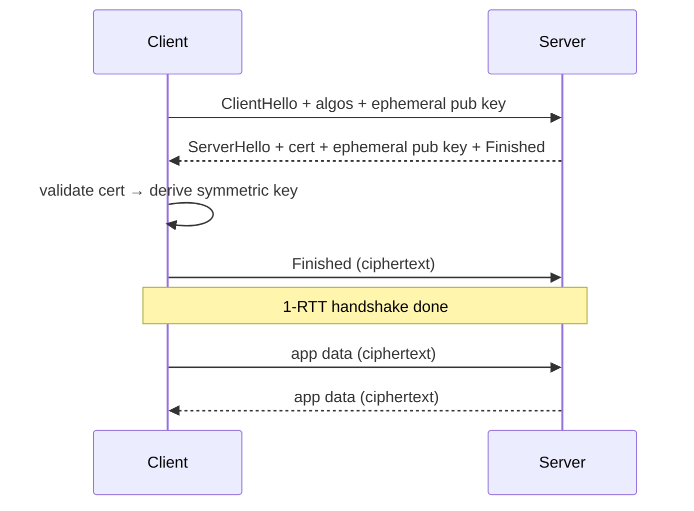

<KeyIdea>
**In one line**: **TLS** sits on top of TCP and gives you **confidentiality, integrity, and authentication**. The two parties exchange a symmetric session key via certificates + public-key crypto, then encrypt all subsequent data with it. HTTPS / SMTPS / IMAPS / DoT / mTLS / gRPC all rely on it.
</KeyIdea>

## What it is

TLS isn't a single protocol — it's a generic mechanism that **wraps another protocol with an encrypted channel**. Common uses:

| Protocol | TLS-wrapped |
| --- | --- |
| HTTP | HTTPS |
| SMTP | SMTPS / STARTTLS |
| IMAP | IMAPS |
| DNS | DoT (DNS over TLS) |
| MQTT | MQTTS |

Mainstream versions: **TLS 1.2** (older but still common) / **TLS 1.3** (recommended — safer and faster).

## Analogy

<Analogy>
TLS is like a **safe-deposit-box system**:
- The two sides securely exchange one common key during the handshake;
- Every letter goes into a same-model safe and travels;
- Even if the postman (ISP) holds the safe, they can't open it.
</Analogy>

## Key concepts

<Terms items={[
  { term: "Symmetric key", en: "Symmetric Key", def: "Negotiated session key (AES); fast both encrypt/decrypt." },
  { term: "Asymmetric key", en: "Asymmetric Key", def: "Public/private key (RSA / ECDHE) used during handshake to safely deliver the symmetric key." },
  { term: "Cert chain", en: "Cert Chain", def: "Server cert → intermediate → root CA. The browser validates signatures along the chain." },
  { term: "PFS", en: "Perfect Forward Secrecy", def: "Each session uses an ephemeral key (ECDHE); even if the long-term private key leaks later, past sessions remain safe." },
  { term: "0-RTT", en: "0-RTT", def: "TLS 1.3 reuses prior session info to send data with zero handshake — fast but with replay risk." },
  { term: "mTLS", en: "Mutual TLS", def: "Both sides present certs; common in service-to-service auth and zero-trust networks." },
]} />

## How it works (TLS 1.3 simplified)

TLS 1.3 dropped static-RSA key exchange, **forces PFS**, and compresses the handshake to 1-RTT.

## Practical notes

- **Prefer TLS 1.3.** Disable 1.0 / 1.1 (PCI / ISO require this).
- **Auto-renew certs**: Let's Encrypt + Caddy / Traefik / certbot — never renew by hand.
- **`openssl s_client -connect host:443 -tls1_3 -servername host`** debugs TLS 1.3.
- **`testssl.sh`** is an open-source scanner for site versions / ciphers / vulns.
- **mTLS**: one cert per service → service mesh (Istio / Linkerd) auto-issues and rotates.
- **Never commit private keys to git.** Production keys live in Vault / KMS / Secret Manager.

## Easy confusions

<Compare
  leftTitle="TLS"
  rightTitle="SSL"
  left={<>
    Standard since 1999, now at 1.3. 
    Modern usage should always say "TLS".
  </>}
  right={<>
    SSL 1/2/3 are TLS's predecessors — **all deprecated**. 
    "SSL certificate" is just a legacy phrase.
  </>}
/>

## Further reading

- [HTTPS](/network/beginner/https)
- [TLS Handshake (deep dive)](/network/advanced/tls-handshake)
- [mTLS](/network/advanced/mtls)
