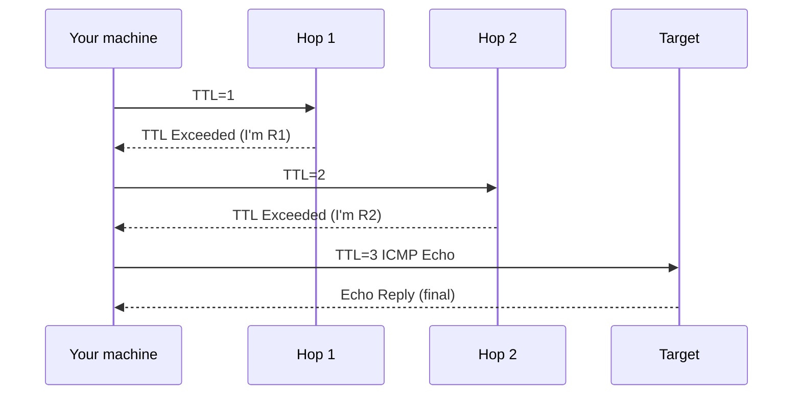

<KeyIdea>
**In one line**: **traceroute** progressively increments the TTL so each router on the path returns "**TTL exceeded**" — yielding the entire path your packets take to a destination, plus per-hop latency.
</KeyIdea>

## What it is

```
$ traceroute -n 8.8.8.8
 1  192.168.1.1   1.2 ms   1.0 ms   1.1 ms
 2  100.64.0.1    8.5 ms   8.2 ms   8.4 ms
 3  202.97.x.x   12.0 ms  11.8 ms  12.1 ms
 ...
 9  8.8.8.8      11.9 ms  12.0 ms  11.8 ms
```

Each line = one router hop; the three RTT samples are three retries.

## How it works



Each hop reports its delay; combined, they reveal **where it's slow / lossy**.

## Key concepts

<Terms items={[
  { term: "TTL", en: "Time To Live", def: "IP-header field decremented per hop; dropped at 0 with an ICMP report." },
  { term: "TTL Exceeded", en: "ICMP Type 11", def: "The 'I dropped it' message — what traceroute relies on to discover hops." },
  { term: "UDP / ICMP / TCP traceroute", en: "three modes", def: "Linux defaults UDP high-port; macOS/Windows default ICMP; `-T` uses TCP — best at crossing firewalls." },
  { term: "* * *", en: "starred hops", def: "Hop didn't reply (filtered by firewall) — doesn't necessarily mean broken." },
  { term: "MPLS hidden", en: "MPLS Hop", def: "Carrier backbones often hide MPLS hops from traceroute." },
]} />

## Practical notes

- **`traceroute -n host`**: skip DNS — faster.
- **`traceroute -T -p 443 host`**: TCP 443 — best chance to **bypass ICMP filters**.
- **`tcptraceroute`** is another TCP-based implementation.
- **`mtr host`**: traceroute + ping in one, **continuously refreshed** with per-hop loss / jitter. **Production triage's first choice.**
- **Stars mid-path are normal.** Many core routers don't reply to TTL-exceeded; if the destination still answers and overall latency is sane, don't worry.
- **Don't trust one run.** Network jitter is constant — **run multiple times / use mtr for long observation**.

## Easy confusions

<Compare
  leftTitle="traceroute"
  rightTitle="mtr"
  left={<>
    Snapshot path from one run.<br />
    Single-run results have noise.
  </>}
  right={<>
    Continuous probing; per-hop live loss / jitter.<br />
    Best for spotting **flaky** links.
  </>}
/>

## Further reading

- [ping](/network/beginner/ping)
- [ICMP](/network/beginner/icmp)
- [mtr deep dive](/network/ecosystem/mtr-traceroute)
- [Wireshark](/network/ecosystem/wireshark)
