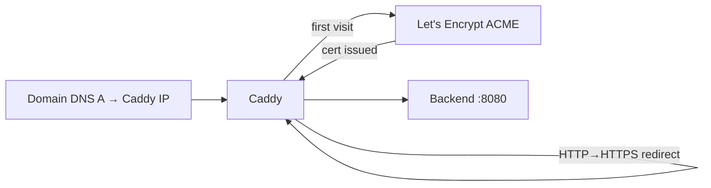

<KeyIdea>
**In one line**: Caddy is a Go web server with **HTTPS on by default** — auto-issues from Let's Encrypt, auto-renews, auto-redirects HTTP → HTTPS. Configuration is so minimal that **a 5-line Caddyfile is a production reverse proxy**.
</KeyIdea>

## What it is

```caddyfile
# The entire Caddyfile:
api.example.com {
    reverse_proxy localhost:8080
}

static.example.com {
    root * /var/www/site
    file_server
    encode gzip zstd
}
```

Run `caddy run` and you get HTTPS, HTTP/2, HTTP/3, and automatic certs — **zero cert config**.

## Analogy

<Analogy>
nginx is **a pro camera** — many dials, professional results, but a learning curve.
Caddy is **a phone camera** — press the shutter, auto-focus / metering / HDR — 90 % of the time it beats the dedicated camera in convenience.
</Analogy>

## Key concepts

<Terms items={[
  { term: "Caddyfile", en: "Caddyfile", def: "Tiny DSL, structured per-host. JSON config also available for fine control." },
  { term: "Auto HTTPS", en: "Auto HTTPS", def: "ACME (Let's Encrypt / ZeroSSL); intranet hostnames can use Caddy's internal CA." },
  { term: "On-demand TLS", en: "On-demand TLS", def: "Cert is issued the moment a user accesses the domain — ideal for multi-tenant setups with many domains." },
  { term: "Modules", en: "Modules", def: "Build via xcaddy with the plugins you need (DNS provider, storage backend, etc.)." },
  { term: "Admin API", en: "Admin API", def: "Local :2019 endpoint for hot config updates without reload." },
]} />

## How it works



The whole cert lifecycle is **invisible** to you.

## Practical notes

- **Needs ports 80 / 443 reachable** for ACME HTTP-01 / TLS-ALPN challenges. Or use DNS challenge (DNS-01) via Cloudflare etc.
- **HTTP/3 on by default** — modern browsers will use it.
- **Local dev**: `caddy run` can issue internal-CA certs for `localhost`; install the root cert and the browser stops complaining.
- **Proxying to IPv6 backends**: `reverse_proxy [::1]:8080` — don't forget the brackets.
- **Tailscale / internal domains**: `*.ts.example.com` + DNS-01 + Tailscale IPs gives you "internet-unreachable but HTTPS internally" in a few lines.
- **HA**: share the same storage (Redis / S3) across instances so they share certs and don't trip Let's Encrypt rate limits.

## Easy confusions

<Compare
  leftTitle="Caddy"
  rightTitle="Traefik"
  left={<>
    Single process + Caddyfile.<br />
    Best for manual / small-scale / clean deployments.
  </>}
  right={<>
    Dynamic discovery (Docker / K8s).<br />
    Best for container orchestration environments.
  </>}
/>

## Further reading

- [nginx](/network/ecosystem/nginx)
- [Traefik](/network/ecosystem/traefik)
- [HTTPS](/network/beginner/https) / [TLS](/network/beginner/tls)
