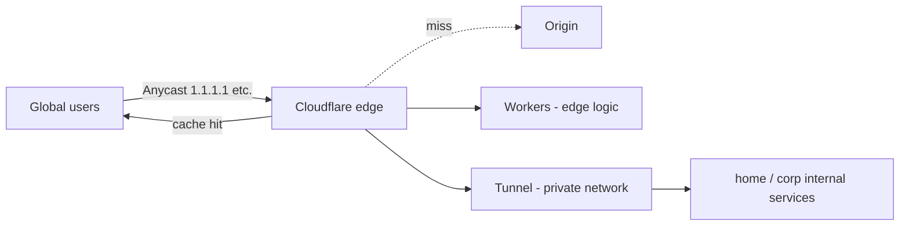

<KeyIdea>
**In one line**: Cloudflare bundles **DNS / CDN / WAF / DDoS protection / edge compute / tunnels** on top of a global Anycast network. The free tier is more than enough for most personal sites, making it the best-value edge stack for small projects.
</KeyIdea>

## What it is

```
Your domain's NS points to Cloudflare
       ↓
Cloudflare gives you:
  - Authoritative DNS (HA, low-latency)
  - HTTPS at the edge (auto TLS, HTTP/3)
  - CDN cache
  - WAF / Bot management / DDoS
  - Workers (edge JS / WASM)
  - Tunnel (expose internal services without opening ports)
  - R2 (S3-compatible object storage)
```

300+ PoPs worldwide — the IP is always the one closest to your user.

## Analogy

<Analogy>
Cloudflare is **a global retail manager** for your website: it opens shops in every city (CDN), hires guards (DDoS / WAF), can **process products on-site** in each shop (Workers), and even gives you **temporary corridors** to ship goods from your warehouse (your private network) without opening loading docks (Tunnel).
</Analogy>

## Key concepts

<Terms items={[
  { term: "Proxied", en: "Orange cloud", def: "Whether a DNS record proxies through Cloudflare (orange) or resolves directly (grey)." },
  { term: "Rulesets", en: "Page Rules / Rulesets", def: "URL-pattern triggers that toggle behavior (cache rules, redirects, header rewrites)." },
  { term: "Workers", en: "Edge JS", def: "Run JS / WASM at each PoP — millisecond cold start." },
  { term: "Tunnel", en: "cloudflared", def: "Daemon inside your private network dials out to Cloudflare — exposes services with **no open ports**." },
  { term: "Zero Trust", en: "Zero Trust", def: "Cloudflare Access — replaces VPN, gates apps by identity + device posture." },
  { term: "R2", en: "Object storage", def: "S3-compatible, **no egress fees** — friendly for static assets / CDN origin." },
]} />

## How it works



Mark a DNS record "proxied" and Cloudflare takes over the traffic.

## Practical notes

- **Cache Everything**: by default Cloudflare only caches static extensions; cache HTML via Cache Rules / Configuration Rules.
- **TLS mode = Full (strict)**: origin must have a valid cert. `Flexible` is plaintext-to-origin — **never use**.
- **Tunnel is the killer feature**: home / corp / NAS — no public IP, no port-forwarding; the daemon **dials outbound** to Cloudflare and exposes services.
- **WAF / Rate Limiting**: even the free tier supports a few rules; combine with Bot Fight Mode.
- **Workers isn't Cloudflare-exclusive syntax**: standard `fetch` / `Response`; develop locally with wrangler, deploy with one command.
- **Don't treat it as the only line of defense.** If your origin IP leaks (e.g. via misconfigured `X-Real-IP`), DDoS can bypass Cloudflare. Allowlist Cloudflare IP ranges in the origin firewall.

## Easy confusions

<Compare
  leftTitle="Cloudflare CDN"
  rightTitle="Self-hosted nginx cache"
  left={<>
    Global Anycast, free DDoS absorption.<br />
    Trivial setup — **value scales with audience**.
  </>}
  right={<>
    Single point / your colo.<br />
    Full control — **DDoS resilience is on you**.
  </>}
/>

## Further reading

- [CDN](/network/advanced/cdn)
- [Anycast & BGP](/network/advanced/anycast-bgp)
- [WireGuard / Tailscale](/network/ecosystem/wireguard-tailscale)
