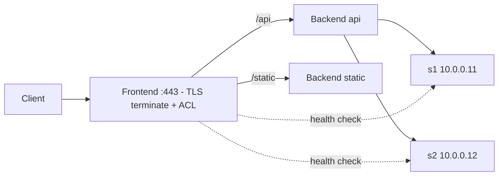

<KeyIdea>
**In one line**: HAProxy is a C-written, high-performance load balancer — **a single instance can handle millions of connections**. It supports L4 (TCP) and L7 (HTTP), with more sophisticated health checks, ACLs, TLS termination, and stick-tables than nginx.
</KeyIdea>

## What it is

```haproxy
frontend www
    bind *:443 ssl crt /etc/ssl/site.pem alpn h2,http/1.1
    default_backend app

backend app
    balance leastconn
    option httpchk GET /healthz
    server s1 10.0.0.11:8080 check
    server s2 10.0.0.12:8080 check
```

`frontend` accepts traffic, `backend` forwards it — a clean separation.

## Analogy

<Analogy>
HAProxy is **air-traffic control**: it watches each runway's status, traffic, and delay in real time and **decides in milliseconds** which runway the next flight uses. Professional, rigorous, no surprises.
</Analogy>

## Key concepts

<Terms items={[
  { term: "Frontend / Backend", en: "Frontend / Backend", def: "Frontend receives, backend forwards. One frontend can fan out to many backends." },
  { term: "Balance algorithm", en: "Balance Algorithm", def: "roundrobin / leastconn / source / uri / hdr etc." },
  { term: "ACL", en: "ACL Rule", def: "Route by path / header / method — `use_backend api if { path_beg /api }`." },
  { term: "Stick table", en: "Stick Table", def: "Sticky sessions / rate limit / protection — extremely fast." },
  { term: "Health check", en: "Health Check", def: "HTTP (option httpchk) or TCP probes." },
  { term: "Runtime API", en: "Runtime API", def: "Unix socket interface — drain a node / change weights live, no reload required." },
]} />

## How it works



Single-process, multi-threaded model — each worker handles connections independently.

## Practical notes

- **`haproxy -c -f config`** to validate before reloading. Reload uses sockets for graceful handover with no dropped connections.
- **TLS termination performance**: hardware acceleration + ECDSA certs lets a single box do 100k+ TPS handshakes.
- **Slow-start / backup / canary**: `slowstart`, `backup` keywords make gradual rollouts and circuit breaking easy.
- **Stats page**: `stats uri /haproxy?stats` — protect with a password, never expose nakedly.
- **TCP mode**: great for proxying MySQL / Redis / Kafka and other non-HTTP protocols.
- **HTTP/3 / QUIC**: built-in since 2.9 with `bind quic4@:443`.

## Easy confusions

<Compare
  leftTitle="HAProxy"
  rightTitle="nginx"
  left={<>
    Specialised LB with advanced health checks / ACLs.<br />
    Strong at both L4 and L7 — stick tables are killer.
  </>}
  right={<>
    Web server + reverse proxy.<br />
    Smoother for serving static assets directly.
  </>}
/>

## Further reading

- [nginx](/network/ecosystem/nginx)
- [Load balancing (L4 vs L7)](/network/advanced/load-balancing)
- [TCP three-way handshake](/network/advanced/tcp-handshake)
