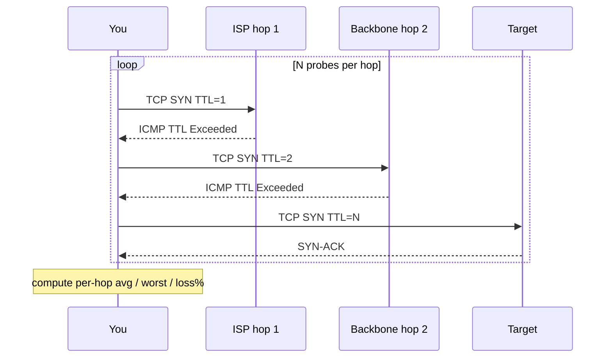

<KeyIdea>
**In one line**: classic ICMP traceroute is often blocked by middleboxes. **mtr probes continuously** for stable per-hop loss; **tcptraceroute / `mtr -T`** switches to TCP-SYN probes that traverse more firewalls.
</KeyIdea>

## What it is

- **mtr** (My Traceroute) = ping + traceroute, continuously refreshed.
- **tcptraceroute**: uses TCP SYN instead of ICMP / UDP probes.
- Together = a stable view of **which hop drops or jitters** over a sustained window.

```bash
mtr -wbz -i 1 -c 100 example.com
mtr -T -P 443 example.com
tcptraceroute example.com 443
```

## Analogy

<Analogy>
A single ping is **a glance at the road** — that moment might just happen to be green-light.
mtr is **a traffic camera running all day** — it tells you which segment is **chronically jammed**.
</Analogy>

## Key concepts

<Terms items={[
  { term: "ICMP TTL Exceeded", en: "TTL Exceeded", def: "Classic traceroute depends on intermediate routers returning this ICMP — many ISPs rate-limit or block it." },
  { term: "TCP traceroute", en: "TCP Probe", def: "Sends TCP SYN to the destination port; intermediate routers still return ICMP, target replies SYN-ACK / RST." },
  { term: "Continuous probe", en: "Continuous Probe", def: "mtr keeps probing — produces per-hop loss / avg / worst latency." },
  { term: "Asymmetric path", en: "Asymmetric Routing", def: "Forward and reverse paths differ — traceroute only sees forward; reverse-path problems need mtr from the other side." },
  { term: "JSON / Report mode", en: "Structured Output", def: "`mtr --json` / `--report` are great for automated collection." },
]} />

## How it works



In mtr's output, the column to focus on is **`Loss%`** — a single bad sample doesn't matter.

## Practical notes

- **`mtr -T -P 443 host`** is the most practical for HTTPS — avoids ICMP rate limiting.
- **Loss only matters at the last hop** — mid-path loss usually means the router rate-limits ICMP, not real loss. Sustained loss at the destination means real problem.
- **Cross-region diagnosis**: run mtr from different PoPs to find the worst segment. Tools: [BestTrace](https://www.ipip.net/product/client.html) / public looking-glasses.
- **Pin source port**: `mtr -T -P 443 -p 12345` keeps ECMP from rerouting your probes to different paths mid-diagnosis.
- **Pipe JSON to alerting**: `mtr -j --report-cycles 30` — script alerts if a hop's loss > 5% for N cycles.

## Easy confusions

<Compare
  leftTitle="mtr / traceroute"
  rightTitle="ping"
  left={<>
    Per-hop latency + loss — **locates the segment**.<br />
    Continuous sampling = trustworthy stats.
  </>}
  right={<>
    End-to-end latency + loss — **detects a problem**.<br />
    Single endpoint view.
  </>}
/>

## Further reading

- [Ping](/network/beginner/ping) / [Traceroute](/network/beginner/traceroute)
- [TCP congestion control](/network/advanced/congestion-control)
- [Wireshark](/network/ecosystem/wireshark)
