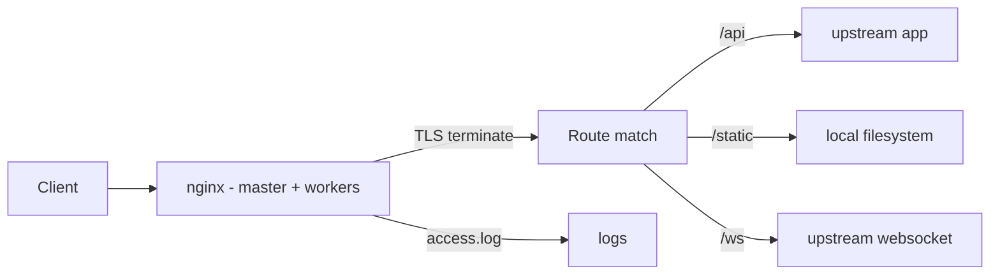

<KeyIdea>
**In one line**: nginx is an event-driven web server in C that doubles as **reverse proxy / static server / load balancer / TLS terminator**. It has the largest production footprint of any web server, and its config file is its API.
</KeyIdea>

## What it is

The two most common shapes:

```nginx
# Reverse proxy a single backend
server {
  listen 443 ssl http2;
  server_name api.example.com;
  ssl_certificate     /etc/letsencrypt/live/api/fullchain.pem;
  ssl_certificate_key /etc/letsencrypt/live/api/privkey.pem;

  location / {
    proxy_pass http://127.0.0.1:8080;
    proxy_set_header Host $host;
    proxy_set_header X-Forwarded-For $proxy_add_x_forwarded_for;
    proxy_set_header X-Forwarded-Proto $scheme;
  }
}

# Load balance across many backends
upstream app {
  server 10.0.0.11:8080 weight=1;
  server 10.0.0.12:8080 weight=2;
  keepalive 64;
}
```

## Analogy

<Analogy>
nginx is **the hotel front desk + switchboard**: guests enter through it. It **welcomes** (TLS terminate), **directs** (routes / path match), **dispatches** (load balance), and **logs** (access log). Real work happens in the back rooms (your app).
</Analogy>

## Key concepts

<Terms items={[
  { term: "Worker processes", en: "Worker Processes", def: "Event-driven + multi-worker. `auto` usually = CPU cores." },
  { term: "Location match", en: "Location Match", def: "= exact / ^~ prefix (skips regex) / ~ regex / default prefix. Priority matters." },
  { term: "Upstream", en: "Upstream", def: "Backend pool. Supports keepalive, weights, least-conn, ip_hash." },
  { term: "Map / If", en: "Conditionals", def: "`map` is for definition-phase mapping; `if` runs inside server/location (**use sparingly**)." },
  { term: "try_files", en: "Fallback", def: "`try_files $uri $uri/ /index.html` — required for SPAs." },
  { term: "limit_req", en: "Rate limit", def: "Leaky bucket: `limit_req_zone $binary_remote_addr zone=...`." },
]} />

## How it works



The event-driven model lets a single process serve 100k+ keep-alive connections.

## Practical notes

- **`nginx -t`** before every reload, then `nginx -s reload`. **Don't `restart`.**
- **Always set `proxy_set_header`** for `Host` / `X-Forwarded-For` / `X-Forwarded-Proto` so the backend sees the real client.
- **WebSocket proxying** needs `proxy_http_version 1.1` + `Upgrade` + `Connection "upgrade"`.
- **Static assets**: pair `expires 1y; add_header Cache-Control "public, immutable";` with versioned filenames.
- **gzip / brotli**: gzip is free; brotli needs a third-party module but compresses better.
- **Log format**: the default `combined` is too thin — add `$request_time` and `$upstream_response_time` to distinguish "slow at nginx" vs "slow at upstream".
- **OpenResty** (nginx + LuaJIT) lets you intercept and rewrite traffic in Lua.

## Easy confusions

<Compare
  leftTitle="nginx"
  rightTitle="Caddy"
  left={<>
    Hand-tune TLS / extremely tweakable.<br />
    Largest ecosystem & docs.
  </>}
  right={<>
    Automatic HTTPS, minimal config.<br />
    Smaller ecosystem, less customizable.
  </>}
/>

## Further reading

- [Caddy](/network/ecosystem/caddy)
- [Traefik](/network/ecosystem/traefik)
- [HAProxy](/network/ecosystem/haproxy)
