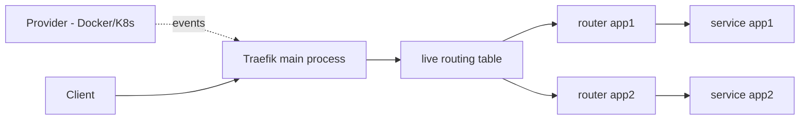

<KeyIdea>
**In one line**: Traefik discovers services via **Providers (Docker / K8s / Consul)** — **no reload, no hand-edited backend lists**. A new container starts, traffic flows; the container stops, it's removed instantly. One of the de-facto standards in the container era.
</KeyIdea>

## What it is

```yaml
# docker-compose.yml excerpt
services:
  traefik:
    image: traefik:v3
    command:
      - --api.insecure=true
      - --providers.docker
      - --entrypoints.web.address=:80
      - --entrypoints.websecure.address=:443
      - --certificatesresolvers.le.acme.tlschallenge=true
      - --certificatesresolvers.le.acme.email=you@example.com
    ports: ["80:80", "443:443", "8080:8080"]
    volumes: ["/var/run/docker.sock:/var/run/docker.sock:ro"]

  app:
    image: my-app
    labels:
      - traefik.enable=true
      - traefik.http.routers.app.rule=Host(`api.example.com`)
      - traefik.http.routers.app.tls.certresolver=le
```

To deploy a new app, **just add labels** — routing and TLS take effect automatically.

## Analogy

<Analogy>
nginx / HAProxy = **a manually-tuned GPS** — every new stop requires editing the route file.
Traefik = **an auto-discovering smart navigator** — you board and disembark anywhere, it **recognises new stops in real time** and replans the route.
</Analogy>

## Key concepts

<Terms items={[
  { term: "EntryPoint", en: "EntryPoint", def: "Listening port — e.g. `web=80`, `websecure=443`." },
  { term: "Router", en: "Router", def: "Matches rule (Host / Path / Method) → points to a Service." },
  { term: "Service", en: "Service", def: "A group of backend instances, auto-discovered from a provider." },
  { term: "Middleware", en: "Middleware", def: "Composable chain: compression, rewriting, rate limiting, auth." },
  { term: "Provider", en: "Provider", def: "Source of service discovery — Docker, K8s Ingress / CRD, Consul, file." },
  { term: "Dashboard", en: "Dashboard", def: "Built-in routing visualization on :8080 (lock it down or disable in prod)." },
]} />

## How it works



When containers come up / down / upgrade, Traefik updates its routing table in milliseconds.

## Practical notes

- **As K8s Ingress alternative**: IngressRoute CRDs are more expressive than vanilla Ingress (middleware chains, TCP/UDP routing).
- **One-click ACME TLS**: supports HTTP / TLS-ALPN / DNS challenge. Use DNS challenge for multi-domain certs.
- **Always lock down the dashboard**: BasicAuth or IP allowlist — otherwise it's exposed.
- **Rolling deploys**: Traefik tracks Docker / K8s state and shifts traffic automatically.
- **TCP / UDP routing**: `tcp.routers.xxx.rule=HostSNI(...)` proxies databases / SSH / etc.
- **Observability**: Prometheus / OpenTelemetry exporters are built in — just turn them on.

## Easy confusions

<Compare
  leftTitle="Traefik"
  rightTitle="nginx Ingress"
  left={<>
    K8s-native UX, CRDs, dynamic.<br />
    Written in Go, plugins via WASM.
  </>}
  right={<>
    nginx-based, mature, stable.<br />
    Weaker dynamic config — needs reload.
  </>}
/>

## Further reading

- [nginx](/network/ecosystem/nginx)
- [Caddy](/network/ecosystem/caddy)
- [Load balancing](/network/advanced/load-balancing)
