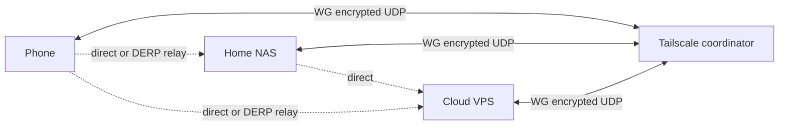

<KeyIdea>
**In one line**: **WireGuard** is a kernel-level UDP VPN — minimal config, ridiculous performance, modern crypto. **Tailscale** layers on **automatic mesh networking + NAT traversal + SSO identity**, so a few clicks join your devices into one private network.
</KeyIdea>

## What it is

A WireGuard config is a handful of lines:

```ini
[Interface]
PrivateKey = ...
Address = 10.0.0.2/24
ListenPort = 51820

[Peer]
PublicKey = ...
AllowedIPs = 10.0.0.1/32
Endpoint = 1.2.3.4:51820
PersistentKeepalive = 25
```

The public key **is** the identity. Source IP doesn't matter — if the keys match, the packet is accepted.

## Analogy

<Analogy>
**WireGuard** = **a point-to-point encrypted rope**: each side ties a knot, pull it tight, and the message travels.
**Tailscale** = **a water utility**: you install a faucet (client) in each house, and the utility **lays pipes for you** (NAT traversal + coordination); turn the tap, water flows.
</Analogy>

## Key concepts

<Terms items={[
  { term: "Peer", en: "Peer", def: "WireGuard has no client/server split — every node is a peer." },
  { term: "AllowedIPs", en: "AllowedIPs", def: "Which destination IPs use this tunnel — the heart of routing." },
  { term: "Roaming", en: "Roaming", def: "WireGuard auto-tracks a peer's current public IP / port — connection survives IP changes." },
  { term: "Tailnet", en: "Tailnet", def: "Your virtual private network in Tailscale — each device gets a stable 100.x.x.x address." },
  { term: "MagicDNS", en: "MagicDNS", def: "Tailscale auto-resolves device names like `laptop.tailnet.ts.net`." },
  { term: "Subnet Router / Exit Node", en: "Subnet Router / Exit Node", def: "Make one node expose a subnet or its internet egress to the whole tailnet." },
]} />

## How it works



Tailscale's control plane **only coordinates keys + discovery**; the data plane is **peer-to-peer WireGuard**.

## Practical notes

- **Self-host WG vs managed Tailscale**: self-host for max performance and zero third-party trust. For multi-device cross-NAT, Tailscale is hard to beat.
- **Tailscale free tier**: 100 devices + 3 users — enough for personal / family.
- **K8s integration**: Tailscale Kubernetes Operator pulls a whole cluster into the tailnet.
- **Pair with Caddy / Cloudflare Tunnel**: internal access via tailnet, public access via Cloudflare Tunnel for selected services — **no exposed public ports**.
- **MTU watch**: WG defaults to 1420; stacking (VPN over VPN, satellite links) needs lower.
- **Audit**: Tailscale ships Network Flow Logs; self-hosted WG uses iptables / nftables counters.

## Easy confusions

<Compare
  leftTitle="Self-hosted WireGuard"
  rightTitle="Tailscale"
  left={<>
    Do everything yourself: key distribution, routing, hole punching.<br />
    Ultimate performance and control.
  </>}
  right={<>
    Auto-mesh / NAT traversal / SSO.<br />
    Depends on a control plane (can self-host Headscale).
  </>}
/>

## Further reading

- [NAT](/network/beginner/nat)
- [TLS handshake](/network/advanced/tls-handshake)
- [Cloudflare](/network/ecosystem/cloudflare) — Tunnel is another traversal solution
