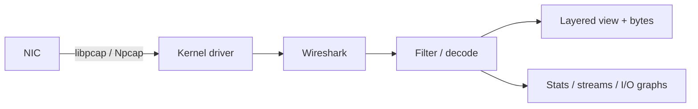

<KeyIdea>
**In one line**: Wireshark captures every packet that hits your NIC and **expands them by protocol layer** — Frame / IP / TCP / TLS / HTTP — at a glance. Every protocol you've studied is **right there to see**, making it the most powerful debugging weapon for networking problems.
</KeyIdea>

## What it is

Pick a NIC → packets stream by → type a filter to focus:

```
ip.addr == 10.0.0.5
tcp.port == 443
http.request
tls.handshake.type == 1     # ClientHello
tcp.flags.reset == 1        # find RST
```

Click any packet and unfold layer by layer: Ethernet → IP → TCP → application.

## Analogy

<Analogy>
Wireshark is **a high-speed camera for networks** — what's invisible to the naked eye in a single second becomes a frame-by-frame slow-motion replay.
</Analogy>

## Key concepts

<Terms items={[
  { term: "Capture Filter", en: "Capture Filter", def: "BPF syntax — decides **what to capture** (e.g. `tcp port 443`). Applied at capture time; essential under heavy traffic." },
  { term: "Display Filter", en: "Display Filter", def: "Wireshark's own syntax (e.g. `tcp.port == 443`) — applied after capture." },
  { term: "Follow Stream", en: "Follow Stream", def: "Right-click → Follow → TCP/HTTP/TLS Stream — reassembles the whole conversation." },
  { term: "I/O Graph", en: "I/O Graph", def: "Plot RTT / retransmits / throughput over time." },
  { term: "TLS decryption", en: "TLS Decryption", def: "Import an SSLKEYLOGFILE to see plaintext (only for TLS sessions originating on this machine)." },
  { term: "tshark", en: "tshark", def: "Headless CLI version — common in CI / remote servers." },
]} />

## How it works



The driver hands a copy of each packet to the capture process — normal traffic is unaffected.

## Practical notes

- **Headless server**: capture with `tcpdump -i any -w out.pcap`, download, open in Wireshark.
- **Common capture filters**: `host 1.2.3.4 and port 443`, `tcp[tcpflags] & (tcp-syn|tcp-rst) != 0`.
- **Decrypt HTTPS**: launch Chrome with `SSLKEYLOGFILE=/tmp/keys.log`, point Wireshark to it via Preferences → TLS.
- **HTTP body invisible?** It's likely HTTPS. HTTP/2 / HTTP/3 / gRPC need their dissectors enabled in Preferences.
- **Slow-request analysis**: `Statistics → Conversations → TCP` for per-stream RTT and bytes; `Expert Info` lists retransmits / out-of-order.
- **Capture is expensive** — in production use `-W` (file count) / `-G` (rotation time) so you don't fill the disk.

## Easy confusions

<Compare
  leftTitle="Wireshark"
  rightTitle="curl -v"
  left={<>
    Bytes captured at the **real network layer**.<br />
    See TLS handshakes / retransmits / loss.
  </>}
  right={<>
    Application-layer view.<br />
    Headers and bodies only — no TCP detail.
  </>}
/>

## Further reading

- [Encapsulation / decapsulation](/network/beginner/encapsulation)
- [TCP three-way handshake](/network/advanced/tcp-handshake)
- [TLS handshake](/network/advanced/tls-handshake)
