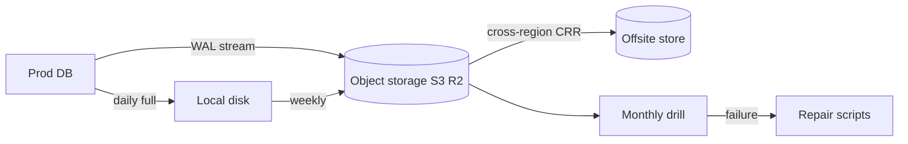

<KeyIdea>
**In one line**: a backup's **only purpose is restore**. **3 copies, 2 media types, 1 off-site** + **regularly drilled restore**, missing any one disqualifies you.
</KeyIdea>

## The 3-2-1 rule

```
3 copies: original + local copy + offsite copy
2 media types: local disk + object storage / tape
1 offsite: another DC / region / cloud
```

Add: **at least 1 immutable copy** (against ransomware; S3 Object Lock / WORM).

## Analogy

<Analogy>
No backup = **only key in your pocket** — lose it, can't get home.
Backup = **multiple keys in a safe** — lose one, still have others; spread across locations means **one fire doesn't take all**.
</Analogy>

## Key concepts

<Terms items={[
  { term: "RTO", en: "Recovery Time Objective", def: "How long to be back online after an incident." },
  { term: "RPO", en: "Recovery Point Objective", def: "How much data loss can be tolerated." },
  { term: "Full / Incremental / Differential", en: "Full / Incremental / Differential", def: "Full is large; incremental is small but restore stacks all; differential is the middle ground." },
  { term: "PITR", en: "Point-in-Time Recovery", def: "Restore to any point in time (DB WAL replay)." },
  { term: "Drill", en: "DR Drill", def: "Periodically restore a backup to a test environment and run end-to-end → only then is it an **effective backup**." },
  { term: "WORM / Object Lock", en: "Immutability", def: "Object storage that can't be deleted / modified for a period — **resists ransomware + accidental delete**." },
]} />

## Typical data types and approaches

<KV items={[
  { k: "PostgreSQL / MySQL", v: "pg_basebackup + WAL streaming / mysqlbackup + binlog → S3. PITR required." },
  { k: "Redis", v: "RDB snapshots + AOF. Use both in production." },
  { k: "Object storage", v: "Cross-region / cross-cloud replication (CRR). S3 → R2, OSS → COS, etc." },
  { k: "K8s config + PVC", v: "Velero backs up etcd objects + volume snapshots." },
  { k: "Code", v: "Image registry + git is itself distributed backup; mirror to GitHub → self-hosted Gitea / GitLab." },
  { k: "Whole VMs", v: "Scheduled cloud snapshots + offsite copy." },
]} />

## How it works



**Monthly full-restore drill** is the most-skipped and most-important step.

## Practical notes

- **Write down RTO / RPO targets** then derive the plan. "1-hour recovery, 5-minute loss" vs "3-day, 1-day" differs by 10× cost.
- **Encrypt backups**: S3 SSE + client keys (KMS); offsite copies encrypted too.
- **Lifecycle policies**: daily for 30 d, monthly for 12 mo, yearly for 5 yr — tiered cost.
- **Automate drills**: monthly restore to a test env + health check; **alert on failure**.
- **Separate delete authority**: backup system credentials are isolated from production credentials so a compromised admin can't wipe backups.
- **Monitor the backups themselves**: failures, upload errors, cross-region lag — all in Prometheus alerts.
- **Don't keep backups only in the same account / cluster** — account compromise = data and backups gone.

## Easy confusions

<Compare
  leftTitle="Backup"
  rightTitle="High Availability (HA)"
  left={<>
    Protects against **data loss / logical mistakes**.<br />
    Historical copies, time travel.
  </>}
  right={<>
    Protects against **instance / DC outage**.<br />
    Real-time sync — **mistakes propagate instantly**.
  </>}
/>

## Further reading

- [Performance tuning](/ops/advanced/performance-tuning)
- [Security hardening](/ops/advanced/security-hardening)
- [Infrastructure as Code](/ops/advanced/iac)
