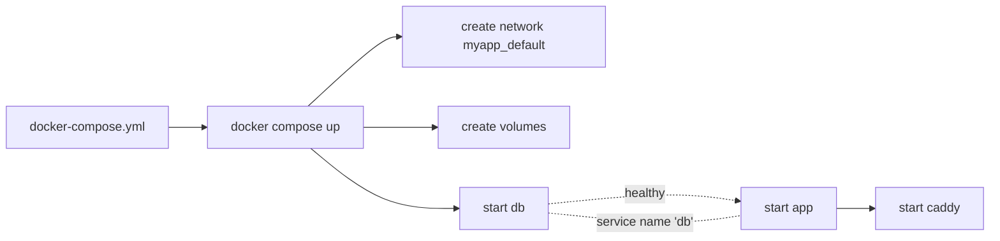

<KeyIdea>
**In one line**: Compose lets you describe DB / cache / app / Nginx in **one docker-compose.yml**, bring them up with **`docker compose up`**, and tear them down cleanly with **`down`**. Fastest path for **single-host deploys / local dev**.
</KeyIdea>

## A typical compose

```yaml
services:
  db:
    image: postgres:16-alpine
    restart: always
    environment:
      POSTGRES_PASSWORD: ${DB_PASSWORD}
    volumes:
      - dbdata:/var/lib/postgresql/data
    healthcheck:
      test: ["CMD", "pg_isready", "-U", "postgres"]
      interval: 5s
      timeout: 3s
      retries: 5

  app:
    build: .
    environment:
      DATABASE_URL: postgres://postgres:${DB_PASSWORD}@db:5432/app
    depends_on:
      db:
        condition: service_healthy
    ports:
      - "3000:3000"

  caddy:
    image: caddy:2
    ports:
      - "80:80"
      - "443:443"
    volumes:
      - ./Caddyfile:/etc/caddy/Caddyfile
      - caddydata:/data
    depends_on:
      - app

volumes:
  dbdata:
  caddydata:
```

Run:

```bash
docker compose up -d
docker compose logs -f app
docker compose ps
docker compose down              # stop containers (keep volumes)
docker compose down -v           # remove volumes too
```

## Analogy

<Analogy>
Single `docker run`s = **powering on each machine by hand**.
compose = **a master switch + wiring diagram** — flip on, everything boots in dependency order; flip off, everything shuts down in order.
</Analogy>

## Key concepts

<Terms items={[
  { term: "service", en: "Service", def: "A container (or multiple replicas) in compose. Other services reach it by name." },
  { term: "network", en: "Network", def: "Each compose project gets a default bridge network; all services auto-join." },
  { term: "volume", en: "Named volume", def: "Persistent storage — visible in `docker volume ls`." },
  { term: "depends_on + healthcheck", en: "Dependencies & readiness", def: "depends_on is only startup order; for real readiness use a healthcheck." },
  { term: "profiles", en: "Profiles", def: "Tag services so they only start with `--profile dev`, to separate prod / debug." },
  { term: "override", en: "Override file", def: "`docker-compose.override.yml` is auto-layered for local-only tweaks." },
]} />

## How it works



Containers resolve each other via **service name** (`db:5432`) — no IP wrangling.

## Practical notes

- **Single-host production is fine**: many personal / small-team projects need only **Compose + one VPS** — not K8s.
- **`.env` for variables**: `docker compose up` auto-loads project-root `.env`.
- **Override files**: local uses `docker-compose.override.yml` (debug ports, code mount); prod uses `docker compose -f compose.yml -f compose.prod.yml up`.
- **Rolling upgrade**: compose v2 `up -d --no-deps --build app` rebuilds only the app without touching db.
- **Always add healthchecks**, especially for db / cache — otherwise the app starts before the DB is ready and crashes.
- **Resource limits (Compose v2 spec)**: `deploy.resources.limits.cpus / memory`.
- **Don't hide state in bind mounts** — use named volumes for backup-friendly storage.

## Easy confusions

<Compare
  leftTitle="docker-compose v1"
  rightTitle="docker compose (v2)"
  left={<>
    Standalone Python tool.<br />
    Long since unmaintained.
  </>}
  right={<>
    Built into the Docker CLI (Go).<br />
    Use this in production.
  </>}
/>

## Further reading

- [Docker basics](/ops/advanced/docker)
- [Dockerfile](/ops/advanced/dockerfile)
- [1Panel / Coolify](/ops/ecosystem/1panel-coolify) — GUI compose for single-host
