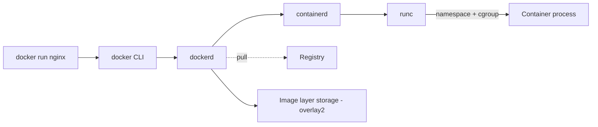

<KeyIdea>
**In one line**: a container is **not** a "lightweight VM" — it's a process isolated by **kernel namespaces + cgroups** plus an isolated filesystem. Docker layers on **image layering + standard interfaces + a friendly CLI** to turn distribution and execution into "pull + run".
</KeyIdea>

## What it is

```bash
# Run nginx in one line
docker run -d --name web -p 8080:80 nginx:1.27

# Inspect
docker ps
docker logs web -f
docker exec -it web sh

# Stop & remove
docker stop web && docker rm web
```

An image is a stack of read-only layers; a container is the image + a writable layer + a running process.

## Analogy

<Analogy>
**VM** = **a full apartment**: own utilities (kernel) — heavy, but fully isolated.
**Container** = **an apartment in a shared building**: shared infrastructure (kernel = the building), but its own door lock (namespace), meter (cgroup), and furniture (filesystem).
</Analogy>

## Key concepts

<Terms items={[
  { term: "Image", en: "Image", def: "Read-only snapshot of app + deps + system libs. Layered storage reuses base layers." },
  { term: "Container", en: "Container", def: "A running instance of an image — own PID / network / filesystem namespaces." },
  { term: "Volume", en: "Volume", def: "Persistent storage. Container deletion doesn't take the volume with it." },
  { term: "Network", en: "Network", def: "Default bridge; custom networks let containers reach each other by name." },
  { term: "Registry", en: "Registry", def: "Docker Hub / GHCR / private Harbor. push / pull all go through it." },
  { term: "OCI", en: "OCI Standard", def: "Image format + runtime spec — Podman / containerd all run Docker images." },
]} />

## How it works



The foundation is kernel namespaces + cgroups — **there's no "Docker kernel"**.

## Practical notes

- **Don't use `latest`** — pin a tag or digest. Production must never run on a drifting tag.
- **`-p host:container`**: host port → container port. Without it, only the docker network can reach it.
- **`-v /host:/container`**: bind-mount a host dir. For data, prefer a named volume `-v dataname:/path`.
- **Env vars**: `-e KEY=VAL` or `--env-file .env`.
- **Resource limits**: `--cpus 1.5 --memory 1g`, otherwise one container can saturate the host.
- **Log driver**: default `json-file`, **switch to journald or forward to ELK / Loki** in production — otherwise disk fills up.
- **`docker system df / prune`** cleans dangling images / volumes / networks.
- **Don't run as root**: `USER` directive in Dockerfile, plus `--read-only` + `--cap-drop=ALL` for hardening.

## Common gotchas

- **Container exits immediately**: the main process ended. Containers have **no concept of background** — main process exits → container ends.
- **Can't reach DB on `localhost` from a container**: from the container's view, localhost is itself. Use `host.docker.internal` or join the same network.
- **Wrong timezone**: bind-mount `-v /etc/localtime:/etc/localtime:ro` or set `TZ`.
- **Slow networking**: check if `--network=host` is in play, and bridge MTU.

## Easy confusions

<Compare
  leftTitle="Image"
  rightTitle="Container"
  left={<>
    Template, **read-only**.<br />
    One image → N containers.
  </>}
  right={<>
    Running instance, **writable**.<br />
    Removing it doesn't affect the image.
  </>}
/>

## Further reading

- [Dockerfile](/ops/advanced/dockerfile)
- [Docker Compose](/ops/advanced/docker-compose)
- [Kubernetes core concepts](/ops/advanced/k8s-core)
