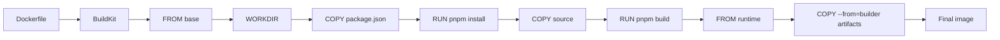

<KeyIdea>
**In one line**: each Dockerfile instruction is a **layer**, and **layers are cacheable and append-only**. Master layers + cache + multi-stage and you'll cut images from 1.2 GB down to 80 MB.
</KeyIdea>

## A good Dockerfile (Node example)

```dockerfile
# ---- builder ----
FROM node:20-alpine AS builder
WORKDIR /app
COPY package.json pnpm-lock.yaml ./
RUN corepack enable && pnpm install --frozen-lockfile
COPY . .
RUN pnpm build

# ---- runtime ----
FROM node:20-alpine
WORKDIR /app
ENV NODE_ENV=production
COPY --from=builder /app/.next ./.next
COPY --from=builder /app/public ./public
COPY --from=builder /app/package.json ./
COPY --from=builder /app/node_modules ./node_modules
EXPOSE 3000
USER node
CMD ["node", "node_modules/next/dist/bin/next", "start"]
```

Build:

```bash
docker build -t myapp:0.1 .
docker build --platform linux/amd64,linux/arm64 -t myapp:0.1 . --push  # buildx
```

## Analogy

<Analogy>
An image is **a stack of transparencies** — each layer overlays the next, and you see the top result (the container's filesystem). **Change a lower layer and everything above gets repainted → cache invalidated**; change only an upper layer (like code) and lower layers (deps) stay → rebuild in seconds.
</Analogy>

## Key concepts

<Terms items={[
  { term: "Layer", en: "Layer", def: "Each RUN / COPY / ADD creates a layer. The magic is that layers are cacheable." },
  { term: "Cache key", en: "Cache Key", def: "Determined by this instruction + checksum of layers above. That's why **COPY package.json then install** beats a single COPY." },
  { term: "Multi-stage", en: "Multi-stage", def: "`FROM ... AS builder` + final stage only COPYs artifacts → toolchain dropped, image stays small." },
  { term: ".dockerignore", en: ".dockerignore", def: "node_modules, .git, build outputs — keep them out of the builder." },
  { term: "BuildKit / buildx", en: "Modern build backend", def: "Parallel builds, cross-arch, cache mounts. Always on in production." },
  { term: "Distroless / scratch", en: "Minimal base", def: "Just the binary + needed libs, no shell. **Secure + small**, but harder to debug." },
]} />

## How it works



Each layer has its own sha256; pushing only sends new layers.

## Practical notes

- **Order**: least-changing on top (base image, deps), most-changing at bottom (source code).
- **`COPY` over `ADD`** — ADD has auto-extract / URL-download magic that's **easy to misuse**.
- **Fewer `RUN`s**: each RUN is a layer. Chain multiple shell commands with `&&`.
- **Only deletion makes things small**: `apt-get install -y X && apt-get clean && rm -rf /var/lib/apt/lists/*` — without the cleanup, the layer keeps the package files.
- **`HEALTHCHECK`** in the Dockerfile lets platforms (Compose / K8s) consume health automatically.
- **`ENV NODE_ENV=production`** + `--frozen-lockfile` for reproducible builds.
- **Skip `latest`**: in CI tag `:1.2.3` + `:1.2` + `:1` so rollback is easy.
- **Multi-arch**: `docker buildx create --use`, then `--platform linux/amd64,linux/arm64`.

## Common anti-patterns

- **Bare `node:20`** ≈ 1 GB → use `node:20-alpine` or `node:20-slim`.
- **Build-time gcc / make leaks into runtime** → use multi-stage.
- **Reinstall deps on every code change** → COPY lockfile first, then install.
- **Secrets baked into image** → BuildKit `--mount=type=secret`, never bake them into a layer.

## Easy confusions

<Compare
  leftTitle="docker build"
  rightTitle="docker buildx"
  left={<>
    Classic single-arch build.<br />
    No parallelism, simple cache.
  </>}
  right={<>
    BuildKit-powered, **multi-platform + remote cache**.<br />
    The current default.
  </>}
/>

## Further reading

- [Docker basics](/ops/advanced/docker)
- [Docker Compose](/ops/advanced/docker-compose)
- [Security hardening](/ops/advanced/security-hardening)
