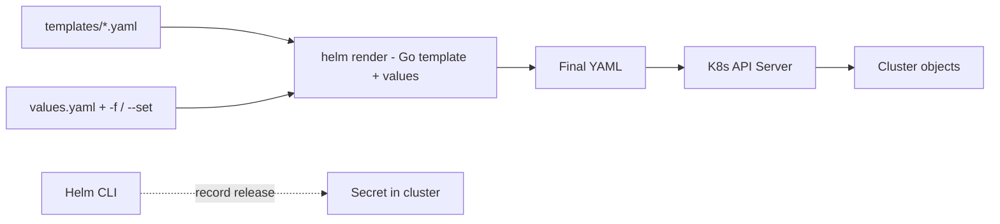

<KeyIdea>
**In one line**: Helm is the **package manager** for K8s. A Chart = Go-templated YAML + default values. **`helm install`** renders into concrete resources; **`helm upgrade --atomic`** auto-rolls back on failure.
</KeyIdea>

## What it is

```
my-chart/
├── Chart.yaml         # name / version / appVersion
├── values.yaml        # defaults
├── templates/
│   ├── deployment.yaml
│   ├── service.yaml
│   └── ingress.yaml
└── charts/            # subchart deps
```

`templates/deployment.yaml` uses Go templates:

```yaml
apiVersion: apps/v1
kind: Deployment
metadata:
  name: {{ include "my-chart.fullname" . }}
spec:
  replicas: {{ .Values.replicaCount }}
  template:
    spec:
      containers:
        - name: app
          image: "{{ .Values.image.repository }}:{{ .Values.image.tag }}"
          resources: {{- toYaml .Values.resources | nindent 12 }}
```

```bash
helm install my-app ./my-chart -f values-prod.yaml
helm upgrade --install my-app ./my-chart -f values-prod.yaml --atomic --wait
helm rollback my-app 3
helm list
```

## Analogy

<Analogy>
Hand-writing K8s YAML is **like writing each contract by hand** — fix a typo and you rewrite the whole thing.
Helm is **a contract template with variables** — name, amount, clauses are parameters, **generate the PDF**.
</Analogy>

## Key concepts

<Terms items={[
  { term: "Chart", en: "Chart", def: "Helm's package format." },
  { term: "Release", en: "Release", def: "An installation instance of a Chart in a cluster. Same chart can be installed multiple times under different release names." },
  { term: "Values", en: "Values", def: "Parameters injected when rendering. values.yaml = defaults; `-f file` and `--set` override." },
  { term: "Repository", en: "Repository", def: "Public / private chart repos — Artifact Hub or an OCI registry." },
  { term: "Hooks", en: "Hooks", def: "Lifecycle hooks: pre-install / post-upgrade / pre-delete, etc." },
  { term: "Atomic / Wait", en: "Atomic / Wait", def: "`--atomic` rolls back on failure; `--wait` blocks until all resources are Ready." },
]} />

## How it works



Each install / upgrade records release history as a Secret in the cluster — that's why rollback works.

## Practical notes

- **Reuse community charts** — Bitnami / cert-manager / ingress-nginx / loki-stack — `helm install` beats hand-rolling YAML.
- **Don't fork charts to edit source** — override via `values.yaml`; if you must change structure, wrap in an "umbrella chart".
- **CI/CD**: Argo CD / Flux speak Helm natively — keep it in your GitOps repo.
- **`helm template`** for debugging — render YAML locally, inspect, then apply, instead of `helm install` failures littering the cluster.
- **`--atomic` + `--wait`** are the production upgrade defaults.
- **Don't put secrets in values** — use sealed-secrets / external-secrets / SOPS.
- **Chart version vs app version**: `Chart.yaml`'s `version` is the chart's own; `appVersion` is the packaged app's version.

## Easy confusions

<Compare
  leftTitle="Helm Chart"
  rightTitle="Kustomize"
  left={<>
    Templates + value injection.<br />
    Fits **standardized packages** to share.
  </>}
  right={<>
    Stack patches, **no template language**.<br />
    Better for in-house customization.
  </>}
/>

## Further reading

- [Kubernetes core concepts](/ops/advanced/k8s-core)
- [Pod / Service / Ingress](/ops/advanced/pod-service-ingress)
- [Argo CD](/ops/ecosystem/argocd) — pairs Helm with GitOps
