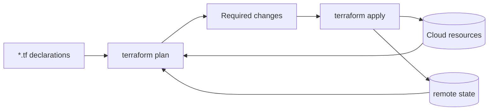

<KeyIdea>
**In one line**: IaC describes "what cloud resources I want" (VPC / VM / DB / DNS) in **declarative code**; the tool diffs current state and **auto-creates / modifies / deletes**. Result: rebuildable environments, reviewable PRs, traceable rollbacks.
</KeyIdea>

## What it is

```hcl
# main.tf — declare AWS resources with Terraform
provider "aws" { region = "us-east-1" }

resource "aws_vpc" "main" {
  cidr_block = "10.0.0.0/16"
  tags       = { Name = "prod" }
}

resource "aws_instance" "web" {
  ami           = "ami-0abcd"
  instance_type = "t3.small"
  subnet_id     = aws_subnet.public.id
  user_data     = file("${path.module}/cloud-init.yml")
  tags          = { Name = "web-1" }
}
```

```bash
terraform init
terraform plan          # what will it do?
terraform apply         # actually do it
terraform destroy       # delete
```

## Analogy

<Analogy>
Without IaC = **hand-throwing pottery** — each piece by feel, not reproducible, redone if broken.
With IaC = **3D model + 3D printer** — one CAD file (code) prints **identical copies repeatedly**.
</Analogy>

## Key concepts

<Terms items={[
  { term: "Declarative", en: "Declarative", def: "You declare desired state; the tool computes the diff. Contrast: imperative shell scripts that do step-by-step." },
  { term: "State", en: "State", def: "Terraform's .tfstate records 'what's currently in the cloud'. **Must be remote-shared + locked** (S3 + DynamoDB / GCS / Terraform Cloud)." },
  { term: "Provider", en: "Provider", def: "AWS / GCP / Azure / Cloudflare / GitHub — almost every cloud resource has a provider." },
  { term: "Module", en: "Module", def: "Reusable resource bundle, function-like." },
  { term: "Drift", en: "Drift", def: "Someone manually edited the cloud → reality diverges from code. `terraform plan` surfaces it." },
  { term: "OpenTofu", en: "OpenTofu", def: "Community fork of Terraform after the BSL license switch — open-source." },
]} />

## Tool comparison

<KV items={[
  { k: "Terraform / OpenTofu", v: "HCL DSL, most widely used. Multi-cloud." },
  { k: "Pulumi", v: "Use real languages (Python / TS / Go) for IaC." },
  { k: "AWS CDK", v: "Also real languages — compiles to CloudFormation. AWS only." },
  { k: "CloudFormation / ARM / Deployment Manager", v: "Cloud-native." },
  { k: "Crossplane", v: "Manage cloud resources as K8s CRDs." },
  { k: "Ansible", v: "More about in-OS config (packages / files / services), but can also manage infra." },
]} />

## How it works



Each apply: **read state + read cloud + read code → compute diff → call cloud APIs**.

## Practical notes

- **Remote state + lock** — local state is a beginner trap. Multi-person collaboration requires remote + lock.
- **`plan` as review artifact** — CI posts `terraform plan` to the PR; merge then `apply`.
- **Tag everything** with env / owner / project — billing-friendly.
- **Don't put everything in one root module** — split by region / env / component, blast radius small.
- **Secrets**: Vault / SOPS / Secrets Manager — never push tfvars to git.
- **Be careful destroying** — `terraform destroy` is irreversible. Add `prevent_destroy = true` to critical resources.
- **Drift detection**: schedule `plan` runs; treat manual edits as drift and **revert to code** (don't retrofit code to manual changes).

## Easy confusions

<Compare
  leftTitle="IaC (cloud)"
  rightTitle="Config mgmt (Ansible / Chef)"
  left={<>
    Create / modify / delete **cloud objects**: VMs, VPCs, DBs.<br />
    Terraform / Pulumi.
  </>}
  right={<>
    On existing machines: **install packages / write configs / start services**.<br />
    Ansible / Chef / Salt.
  </>}
/>

## Further reading

- [CI/CD pipeline](/ops/advanced/cicd-pipeline)
- [Terraform / OpenTofu](/ops/ecosystem/terraform-opentofu)
- [Ansible](/ops/ecosystem/ansible)
