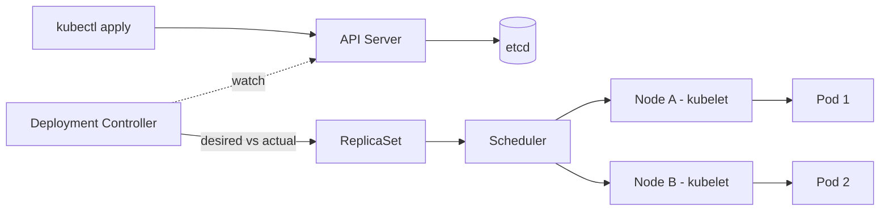

<KeyIdea>
**In one line**: Kubernetes is **cluster-level** container orchestration. You write **desired state** (YAML) and its control loops **continuously reconcile reality toward that state**. If concepts feel overwhelming, start by memorizing 5 objects: Pod / Deployment / Service / Ingress / Namespace.
</KeyIdea>

## What it is

```yaml
# Deployment: 3 replicas of a web app
apiVersion: apps/v1
kind: Deployment
metadata: { name: web }
spec:
  replicas: 3
  selector: { matchLabels: { app: web } }
  template:
    metadata: { labels: { app: web } }
    spec:
      containers:
        - name: app
          image: ghcr.io/me/web:1.2.0
          ports: [{ containerPort: 8080 }]
          resources:
            limits: { cpu: 500m, memory: 512Mi }
            requests: { cpu: 100m, memory: 128Mi }
---
# Service: stable DNS name for these Pods
apiVersion: v1
kind: Service
metadata: { name: web }
spec:
  selector: { app: web }
  ports: [{ port: 80, targetPort: 8080 }]
```

## Analogy

<Analogy>
You don't tell a worker "**lay this brick**" (imperative). You hand a **blueprint** (YAML) to a project manager (controller), who **has a crew constantly inspecting**: missing brick → add it; misaligned → straighten; collapsed → rebuild — that's declarative + control loops.
</Analogy>

## Five most-used objects

<Terms items={[
  { term: "Pod", en: "Pod", def: "Smallest scheduling unit, one or more tightly-coupled containers sharing network namespace and volumes." },
  { term: "Deployment", en: "Deployment", def: "Manages stateless Pod lifecycles — rolling upgrades / rollbacks." },
  { term: "Service", en: "Service", def: "Stable DNS name + virtual IP fronting a set of Pods." },
  { term: "Ingress", en: "Ingress", def: "L7 routing — maps external hostnames / paths to Services (implemented by nginx / Traefik / etc.)." },
  { term: "Namespace", en: "Namespace", def: "Logical partition inside the cluster (dev / prod / kube-system)." },
]} />

## How it works



K8s is fundamentally **a pile of controllers watching the API server and reconciling**.

## Key commands

```bash
kubectl get pods -A                            # all namespaces
kubectl describe pod web-xxxxx
kubectl logs -f web-xxxxx
kubectl exec -it web-xxxxx -- sh
kubectl apply -f manifest.yaml
kubectl rollout status deploy/web
kubectl rollout undo deploy/web
kubectl top pod
kubectl explain deployment.spec.template.spec.containers   # field docs
```

## Practical notes

- **Always set resource requests/limits** — scheduler uses requests; limits prevent one Pod from saturating the node.
- **Don't `kubectl exec` to fix things in place** — edit YAML → apply, otherwise the next rollout wipes your fix.
- **Three probes**: `livenessProbe` (alive?), `readinessProbe` (accepting traffic?), `startupProbe` (slow boot tolerance).
- **Pods are ephemeral** — can be evicted or rescheduled at any time. Apps must be **stateless** or store state in PVC / external DB.
- **Rolling updates**: default `RollingUpdate`, controlled via `maxUnavailable` / `maxSurge`.
- **HPA**: `kubectl autoscale deploy/web --cpu-percent=70 --min=2 --max=10`.
- **Learning ladder**: minikube / k3s → deploy a real app → learn Helm → then service mesh / operators.

## Easy confusions

<Compare
  leftTitle="Pod"
  rightTitle="Container"
  left={<>
    K8s scheduling unit, **may contain 1–N tightly-coupled containers**.<br />
    Shared network + volumes.
  </>}
  right={<>
    A running instance inside a Pod.<br />
    One element in the `containers:` array.
  </>}
/>

## Further reading

- [Pod / Service / Ingress details](/ops/advanced/pod-service-ingress)
- [Helm](/ops/advanced/helm)
- [Docker Compose](/ops/advanced/docker-compose) — single-host alternative
