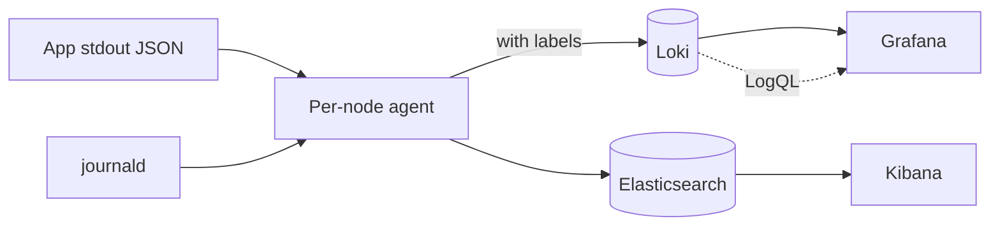

<KeyIdea>
**In one line**: at any meaningful scale, **logs must be centralized** — collect → parse → index → query → alert. Two mainstream paths: **ELK / OpenSearch** (full-text index, powerful but expensive) and **Loki** (label index, cheap and good enough).
</KeyIdea>

## What it is

```
[App stdout]   ──┐
[journal]     ──┼──> [collector agent] ──> [central store] ──> [query UI]
[file logs]    ──┘    Promtail/Vector/    Loki/ES            Grafana/Kibana
                     Fluent Bit
```

Apps **logging to stdout** is the cloud-native default; agents on each node ship logs to the central store.

## Analogy

<Analogy>
Single-machine logs = **each household keeps their own diary** — finding something means **knocking on every door and reading**.
Log aggregation = **a village library** — every household automatically deposits their diary, and you search in one place.
</Analogy>

## Key concepts

<Terms items={[
  { term: "Structured logs", en: "Structured", def: "JSON lines, not plain text: `{level, ts, trace_id, msg, ...}`. Otherwise parsing is regex hell." },
  { term: "Trace ID", en: "Trace ID", def: "Unique ID threading one request through the system. Key to log↔trace correlation." },
  { term: "Collector agent", en: "Collector", def: "Promtail / Vector / Fluent Bit / OpenTelemetry Collector." },
  { term: "Inverted index", en: "Inverted Index", def: "ES indexes every token — **full-text search anywhere**, but costly in disk / RAM." },
  { term: "Label index (Loki)", en: "Label Index", def: "Only labels are indexed (service / pod / level); body isn't. Cheap to query; full-text means scanning." },
  { term: "Retention", en: "Retention", def: "Hot data 7–30 days + cold archive (S3 / OSS) for months." },
]} />

## How it works



The de-facto K8s combo: Promtail/Fluent Bit + Loki + Grafana.

## Practical notes

- **Standardize JSON logs**: `{"ts":"...","level":"info","trace_id":"abc","msg":"...","fields":{...}}`.
- **Labels for dimensions, body for the message**: service / pod / level / env are good labels; user_id / order_id go into the message for search.
- **Don't dump all K8s annotations into labels** — Loki / ES index will explode.
- **Sample high-volume logs** — debug shouldn't reach production, or sample at 1 / 100.
- **PII masking**: replace phone / ID / token with `***` at the agent.
- **Trace ↔ Log jumps**: logs carry `trace_id`; Grafana lets you click into Tempo to see the trace, and vice versa.
- **Disk protection**: log retention + log rotation, so a node doesn't fill its disk.

## Picking a stack

<KV items={[
  { k: "ELK / OpenSearch", v: "Powerful full-text search / complex queries. Heavy, expensive, ops-intensive." },
  { k: "Loki + Grafana", v: "Cheap label index, smooth K8s UX. Weaker full-text search." },
  { k: "ClickHouse / Doris", v: "Massive structured-log SQL analytics. Needs schemas." },
  { k: "Datadog / cloud SaaS", v: "Easy mode, billed per GB — gets pricey at scale." },
]} />

## Easy confusions

<Compare
  leftTitle="Logs"
  rightTitle="Metrics"
  left={<>
    Events / text — **detailed, large volume**.<br />
    Best for "what happened".
  </>}
  right={<>
    Numbers / time series — **small after aggregation**.<br />
    Best for "what's the current state".
  </>}
/>

## Further reading

- [Log system (journalctl)](/ops/beginner/log-system)
- [Prometheus metrics model](/ops/advanced/prometheus-metrics)
- [Loki](/ops/ecosystem/loki)
