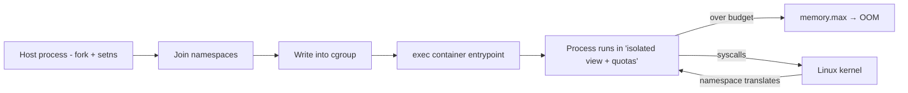

<KeyIdea>
**In one line**: containers aren't VMs — they are **regular processes with a special view of the world**. The view comes from **namespaces** (PID / Net / Mount / UTS / IPC / User / Cgroup — 7 of them); the quotas come from **cgroup v2**. Docker / Podman / containerd are wrappers over those primitives.
</KeyIdea>

## What it is

```bash
# Build a minimal "container" by hand with unshare
sudo unshare --pid --net --mount --uts --ipc --fork --mount-proc /bin/bash
# inside: ps shows only yourself; ip a shows no NIC; hostname xxx doesn't leak out
```

cgroup v2 uses **a single unified hierarchy**:

```
/sys/fs/cgroup/                ← cgroup v2 root
  └── system.slice/web.service/
        memory.max     = 512M
        cpu.max        = "20000 100000"   # 20 % of one CPU
        pids.max       = 200
```

Write a PID into `cgroup.procs` to apply.

## Analogy

<Analogy>
**namespace** = strap **a VR headset** onto the process: the "world" it sees is altered but the hardware is the same;
**cgroup** = assign **a meal-portion manager**: per-day budget for CPU / memory / IO — exceed it and you starve or get smacked.
</Analogy>

## Seven namespaces

<KV items={[
  { k: "PID", v: "Process-ID space. PID 1 in the container is its init; host processes invisible." },
  { k: "Net", v: "Own NIC / routes / iptables / ports. Docker creates a veth pair per container." },
  { k: "Mount", v: "Own mount table. The container's `/` is an overlayfs stitched view." },
  { k: "UTS", v: "Own hostname / domainname." },
  { k: "IPC", v: "Own System V IPC / POSIX message queues." },
  { k: "User", v: "UID/GID mapping. Container root (uid=0) mapped to non-root on host — key for rootless." },
  { k: "Cgroup", v: "Restricts visibility of the cgroup tree; container can't see host cgroups." },
]} />

## Key cgroup v2 controllers

<Terms items={[
  { term: "memory", en: "Memory", def: "`memory.max` hard limit → OOM-kill on excess. `memory.high` soft cap triggers reclaim." },
  { term: "cpu", en: "CPU", def: "`cpu.max = quota period` (e.g. 50000 100000 = 50%). `cpu.weight` is relative weighting." },
  { term: "io", en: "IO", def: "`io.max` caps read/write bandwidth or IOPS per device." },
  { term: "pids", en: "Process count", def: "Prevents fork bombs." },
  { term: "cpuset", en: "CPU pinning", def: "`cpuset.cpus = 0-3` pins the container to those cores." },
  { term: "freezer", en: "Freezer", def: "Pause / resume a group — for debugging and migration." },
]} />

## How it works



Each syscall, the kernel returns a **restricted view** based on the namespaces of that process.

## Practical notes

- **Direct observation**: `ls /proc/<pid>/ns/` shows what namespaces a process is in; `cat /proc/<pid>/cgroup` shows the cgroup path; `systemctl status <svc>` lists resource usage (systemd uses cgroup v2).
- **systemd resource control**: `systemctl set-property web.service MemoryMax=1G CPUQuota=50%` — **applies live**.
- **Rootless containers**: user-namespace maps an unprivileged host user to root inside the container; pair with fuse-overlayfs / slirp4netns for storage / networking.
- **OOM-killer behavior**: cgroup OOM only kills inside that cgroup — **other host services are untouched**. This is the foundation of Docker memory limits.
- **Mixed workloads**: prefer `cpu.weight` over `cpu.max` — yields when others idle, splits proportionally when contended; safer for K8s pod cohabitation.
- **cgroup v1 vs v2**: v1 had many tangled hierarchies; v2 unified to one tree. **Modern kernels default to v2**; older K8s + older Docker may still be v1.

## Easy confusions

<Compare
  leftTitle="namespace"
  rightTitle="cgroup"
  left={<>
    Isolates **what is seen**.<br />
    PID / network / mount / hostname…
  </>}
  right={<>
    Limits **how much is used**.<br />
    CPU / memory / IO / process count.
  </>}
/>

## Further reading

- [Docker basics](/ops/advanced/docker)
- [Kubernetes core concepts](/ops/advanced/k8s-core)
- [Docker / Podman / containerd](/ops/ecosystem/docker-vs-podman)
