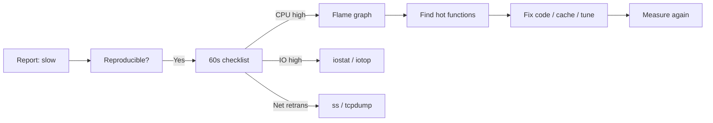

<KeyIdea>
**In one line**: always **measure** before you **change**. Brendan Gregg's **USE method** (Utilization / Saturation / Errors) plus the **60-second checklist** finds 80 % of bottlenecks in 5 minutes.
</KeyIdea>

## 60-second checklist

```bash
uptime              # load 1/5/15 min; > #cores = backlog
dmesg | tail        # OOM? disk errors?
vmstat 1 5          # r col = CPU runq, si/so = swap, wa = IO wait
mpstat -P ALL 1     # per-CPU; single-core saturated = lock contention?
pidstat 1           # which process eats CPU
iostat -xz 1        # %util, await
free -m             # mem / cache / swap
sar -n DEV 1 5      # NIC throughput
sar -n TCP,ETCP 1 5 # TCP retrans / segs
top / htop          # overview
```

## Analogy

<Analogy>
Performance tuning is like **a doctor's exam**: take temperature, blood pressure, blood test (USE metrics) before prescribing pills (tweaking knobs).
</Analogy>

## USE method

<Terms items={[
  { term: "Utilization", en: "Utilization", def: "Percent of time the resource is busy. CPU 80 %, disk 70 %." },
  { term: "Saturation", en: "Saturation", def: "Queue depth waiting for the resource. runq, IO wait, TCP listen overflow." },
  { term: "Errors", en: "Errors", def: "Drops, IO errors, OOMs." },
]} />

Apply each dimension to: CPU, memory, disk, network.

## Quick reference

<KV items={[
  { k: "CPU utilization", v: "top, mpstat" },
  { k: "CPU saturation", v: "uptime (loadavg), vmstat r" },
  { k: "CPU errors", v: "perf stat (cache miss / branch miss)" },
  { k: "Mem utilization", v: "free, /proc/meminfo" },
  { k: "Mem saturation", v: "vmstat si/so (swap), dmesg OOM" },
  { k: "Disk utilization", v: "iostat -x %util" },
  { k: "Disk saturation", v: "iostat await, vmstat wa" },
  { k: "Disk errors", v: "dmesg, smartctl" },
  { k: "Net utilization", v: "sar -n DEV, nload" },
  { k: "Net saturation", v: "ss -ti (cwnd, rwnd), netstat -s retrans" },
  { k: "Net errors", v: "ip -s link, ethtool -S" },
]} />

## Flame graphs + perf

```bash
# Sample for 30s
sudo perf record -F 99 -ag -- sleep 30
sudo perf script | inferno-flamegraph > flame.svg
```

Flame graph = **horizontal: sample share; vertical: call stack** — see at a glance where CPU time goes.

## How it works



**Always re-measure after changes** — otherwise you may have fixed something unrelated.

## Practical notes

- **Two flavors of "slow"**: throughput slow / per-request latency. **Identify which** before picking tools.
- **Don't tune knobs first** — check app / DB indexes / cache hit rate; most bottlenecks are in app code, not the kernel.
- **High CPU isn't always bad** — batch jobs maxing CPU is good; **long wait times** are bad.
- **Network**: watch retrans / TCP state distribution — `ss -tan` + `netstat -s`. Retrans > 1 % → check the link.
- **Swap cautiously** — using swap on a server usually means a slide is starting; OOM-killing is more controllable.
- **eBPF tools**: bcc / bpftrace are modern weapons (execsnoop / opensnoop / biosnoop / tcptop).
- **Baselines matter** — collect normal metrics so when something goes wrong you can compare.

## Easy confusions

<Compare
  leftTitle="High load average"
  rightTitle="High CPU utilization"
  left={<>
    Includes processes **waiting for I/O**.<br />
    CPU might be idle but disk stuck.
  </>}
  right={<>
    CPU actually executing code.<br />
    Use perf / flame graphs to find hot spots.
  </>}
/>

## Further reading

- [Processes & signals](/ops/beginner/process-signal)
- [Log aggregation](/ops/advanced/log-aggregation)
- [Prometheus metrics model](/ops/advanced/prometheus-metrics)
