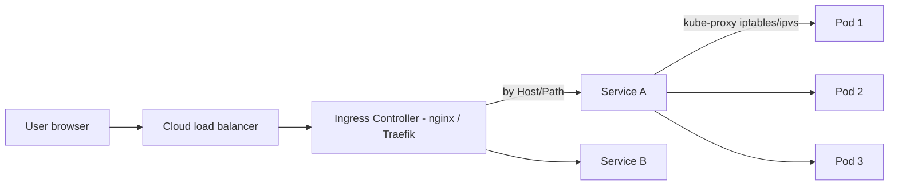

<KeyIdea>
**In one line**: **Pods** run containers, **Services** front a Pod set with a stable virtual IP + DNS, **Ingress** maps external hostnames / paths to Services. Stacked, they form K8s's request path.
</KeyIdea>

## What it is

```yaml
# Pod = the worker — usually managed via Deployment
# Service = the receptionist, round-robins to backend Pods
apiVersion: v1
kind: Service
metadata: { name: web, namespace: prod }
spec:
  selector: { app: web }
  ports: [{ port: 80, targetPort: 8080 }]
  type: ClusterIP        # default — reachable inside cluster
---
# Ingress = the lobby manager, routes by Host / Path
apiVersion: networking.k8s.io/v1
kind: Ingress
metadata:
  name: web
  annotations:
    cert-manager.io/cluster-issuer: letsencrypt
spec:
  ingressClassName: nginx
  rules:
    - host: app.example.com
      http:
        paths:
          - path: /
            pathType: Prefix
            backend:
              service: { name: web, port: { number: 80 } }
  tls:
    - hosts: [app.example.com]
      secretName: web-tls
```

## Analogy

<Analogy>
Pod = **a chef in the kitchen** — three may be working the same dish, IPs come and go.
Service = **the runner**, exposes one stable window outside; routes orders to any free chef.
Ingress = **the maître d'**, seats customers (Host / Path) at the right window.
</Analogy>

## Service types

<KV items={[
  { k: "ClusterIP", v: "Default; cluster-internal only. DNS: svc.namespace.svc.cluster.local." },
  { k: "NodePort", v: "Opens a 30000–32767 port on every node — fine for dev / debug." },
  { k: "LoadBalancer", v: "Cloud provider provisions a real LB (ALB / NLB / SLB) — production external exposure." },
  { k: "ExternalName", v: "DNS CNAME to an external host (e.g. alias svc → RDS endpoint)." },
  { k: "Headless (clusterIP: None)", v: "No VIP — DNS returns all Pod IPs. Required for StatefulSets." },
]} />

## How it works



On each node `kube-proxy` maintains iptables/ipvs rules that **DNAT** the ClusterIP to actual Pods.

## Practical notes

- **Don't hard-code Pod IPs** — always go through Service DNS (`web.prod.svc.cluster.local`; you can omit the trailing parts in-namespace).
- **Name your Service ports**: `ports: [{name: http, port: 80}]` — easier for Ingress / NetworkPolicy references.
- **Ingress Controllers are the standard "expose-outside" tool** — pick one (nginx / Traefik / Envoy / Caddy).
- **Automatic TLS**: install cert-manager and annotate to auto-issue Let's Encrypt certs.
- **NodePort vs LoadBalancer vs Ingress**: lots of NodePorts get unmanageable; a single external LB → Ingress is cleanest.
- **NetworkPolicy**: by default, all Pods can talk to all Pods. NetworkPolicy gates east-west — foundation of zero trust.
- **Canary / Blue-green**: install Argo Rollouts or Istio — **100× easier than rolling weights yourself**.

## Easy confusions

<Compare
  leftTitle="Service"
  rightTitle="Ingress"
  left={<>
    Cluster-internal **TCP / UDP** abstraction.<br />
    L4.
  </>}
  right={<>
    External **HTTP / HTTPS** routing.<br />
    L7, depends on a controller.
  </>}
/>

## Further reading

- [Kubernetes core concepts](/ops/advanced/k8s-core)
- [Helm](/ops/advanced/helm)
- [Load balancing](/network/advanced/load-balancing)
