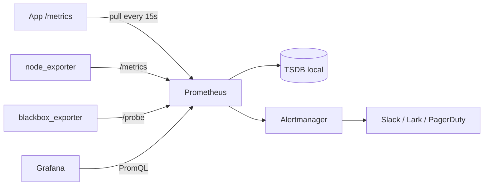

<KeyIdea>
**In one line**: Prometheus periodically **HTTP-pulls** each target's `/metrics` endpoint and stores multi-dimensional time series in its TSDB. **Metrics + labels + PromQL** is its entire universe.
</KeyIdea>

## What it is

Each monitored target exposes a `/metrics` endpoint:

```
# HELP http_requests_total Total HTTP requests
# TYPE http_requests_total counter
http_requests_total{method="GET",status="200",path="/api"} 12345
http_requests_total{method="POST",status="500",path="/api"} 12

# HELP http_request_duration_seconds Latency
# TYPE http_request_duration_seconds histogram
http_request_duration_seconds_bucket{le="0.1"} 9000
http_request_duration_seconds_bucket{le="0.3"} 9800
http_request_duration_seconds_bucket{le="+Inf"} 10000
http_request_duration_seconds_count 10000
http_request_duration_seconds_sum 320.5
```

Prometheus scrapes every 15 s, the TSDB stores it, and Grafana queries.

## Analogy

<Analogy>
Old monitoring = **mailing log lines one by one** — fixed, noisy, slow to query.
Prometheus = **stick a thermometer on each object** — auto-records numbers along time + label dimensions (host / path / status code), so you can **slice and aggregate any way**.
</Analogy>

## Four metric types

<Terms items={[
  { term: "Counter", en: "Counter", def: "Monotonic — resets to 0 on restart. Pair with `rate()` for per-second deltas." },
  { term: "Gauge", en: "Gauge", def: "Up-and-down instantaneous value (CPU usage, temperature, current connections)." },
  { term: "Histogram", en: "Histogram", def: "Set of `_bucket` series; combine with `histogram_quantile()` to compute P50/P99 latency." },
  { term: "Summary", en: "Summary", def: "Client-side quantiles. **Can't aggregate across instances** — Histogram is preferred." },
]} />

## PromQL cheatsheet

```promql
# Per-second HTTP request rate
rate(http_requests_total[1m])

# 5xx ratio
sum(rate(http_requests_total{status=~"5.."}[5m]))
  / sum(rate(http_requests_total[5m]))

# P99 latency
histogram_quantile(0.99, sum by (le) (rate(http_request_duration_seconds_bucket[5m])))

# CPU usage
100 - 100 * avg by (instance) (rate(node_cpu_seconds_total{mode="idle"}[5m]))

# Memory available ratio
node_memory_MemAvailable_bytes / node_memory_MemTotal_bytes
```

## How it works



Whole pipeline: **app / exporter exposes → Prometheus scrapes → alerting + visualization**.

## Practical notes

- **Don't put high-cardinality dimensions in labels** — user_id / request_id as a label will **explode** memory. Labels are bounded enums (method, status, path template).
- **Parameterize HTTP paths**: normalize `/users/123 / 124 / 125` to `/users/:id`, otherwise the path becomes infinite-cardinality.
- **Histogram buckets should match the SLI**: defaults often aren't right — pick buckets at thresholds you care about (10ms, 50ms, 200ms, 1s).
- **node_exporter / cadvisor / kube-state-metrics** — the base trio for host + container + K8s metrics.
- **Retention**: local default 15 days; long-term: Mimir / Thanos / VictoriaMetrics.
- **Alerts go to Alertmanager** — grouping / inhibition / silencing; don't wire one webhook per alert.
- **Four golden signals**: latency, traffic, errors, saturation — the Google SRE canon.

## Easy confusions

<Compare
  leftTitle="Pull (Prometheus)"
  rightTitle="Push (StatsD)"
  left={<>
    Service exposes /metrics; Prom scrapes.<br />
    Plays well with service discovery / health checks.
  </>}
  right={<>
    Service pushes to a collector.<br />
    Short jobs (cron / Lambda) need Pushgateway.
  </>}
/>

## Further reading

- [Log aggregation](/ops/advanced/log-aggregation)
- [Prometheus + Grafana stack](/ops/ecosystem/prometheus-grafana)
- [Security hardening](/ops/advanced/security-hardening)
